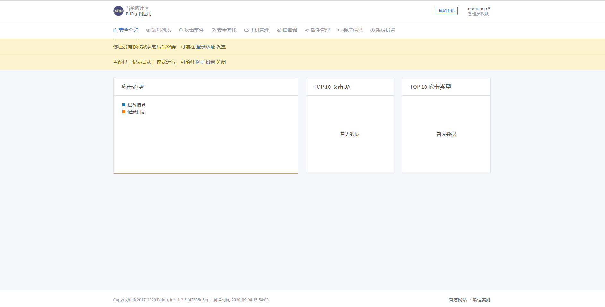

# RASP安装
` @Time : 2020年9月27日, 0027 16:14`
` @Author  : 862897316@qq.com`
` @Software: PyCharm`

```
开始编写
```
### 地址
```angular2html
源代码 https://github.com/baidu/openrasp
https://github.com/baidu/openrasp/releases

国内下载 https://packages.baidu.com/app/openrasp/release/1.3.5/

中文说明 https://rasp.baidu.com/doc/install/software.html
```

### 安装数据库
>  ElasticSearch 和 MongoDB 

#### MongoDB
```
sudo vim /etc/yum.repos.d/mongodb-org-4.2.repo

[mongodb-org-4.2]
name=MongoDB Repository
baseurl=https://repo.mongodb.org/yum/redhat/7/mongodb-org/4.2/x86_64/
gpgcheck=1
enabled=1
gpgkey=https://www.mongodb.org/static/pgp/server-4.2.asc


sudo yum install -y mongodb-org

sudo service mongod start
sudo service mongod stop
sudo service mongod restart

设置开机自启动
systemctl enable mongod.service
查询开机自启动服务
systemctl list-unit-files

yum install java-1.8.0-openjdk* -y
```

#### ElasticSearch

> 我这里使用的docker，测试了本地安装，一直失败，刚好docker也能用，
> 
>首先配置docker加速，
>

```angular2html
sudo mkdir -p /etc/docker
sudo tee /etc/docker/daemon.json <<-'EOF'
{
  "registry-mirrors": ["https://用自己的.mirror.aliyuncs.com"]
}
EOF
sudo systemctl daemon-reload
sudo systemctl restart docker

```
#### 下载容器`docker pull elasticsearch:5.6
> 这里要注意，要按照要求的版本下载，rasp需求是大于等于5.6，小于7.0，因为目前不兼容7.0
> 启动docker的网络连接`docker network create esnet`,然后就可以启动容器，部署rasp
```angular2html
docker run --name es  -p 9200:9200 -p 9300:9300 -dit --network esnet -e "discovery.type=single-node" 752be83a5396 /bin/bash 
```

### 安装rasp-clound管理后台

> 首先，编辑 `conf/app.conf` 文件，修正 `ElasticSearch` 和 `MongoDB` 两个服务器的地址。如果这两个数据库都安装在了本机，且使用默认端口，请跳过此步骤:
```angular2html
[prod]
EsAddr = http://127.0.0.1:9200
EsUser =
EsPwd =
MongoDBAddr = 127.0.0.1:27017
MongoDBUser =
MongoDBPwd =
```

> 关于 `MongoDB` 认证配置，可参考 `mongoDB Linux` 认证配置、重置密码、远程登录配置详解 文章操作；如果 MongoDB 有主从，只需要填写主地址。

`https://blog.csdn.net/jianleking/article/details/79715097`

> 然后，在终端里执行如下命令，启动后台服务器:`./rasp-cloud -d`

> 最后，在浏览器里打开 `http://your-ip:8086`，登录管理后台。其中用户名固定为 `openrasp`，初始密码为 `admin@123`。如果不能访问，请检查防火墙设置，或者检查 logs/api/agent-cloud.log 下面的错误信息。

> 登录成功后，请根据 `管理后台` - `添加主机` 文档，了解如何添加第一台主机。




> 乾坤未定,你我皆是黑马