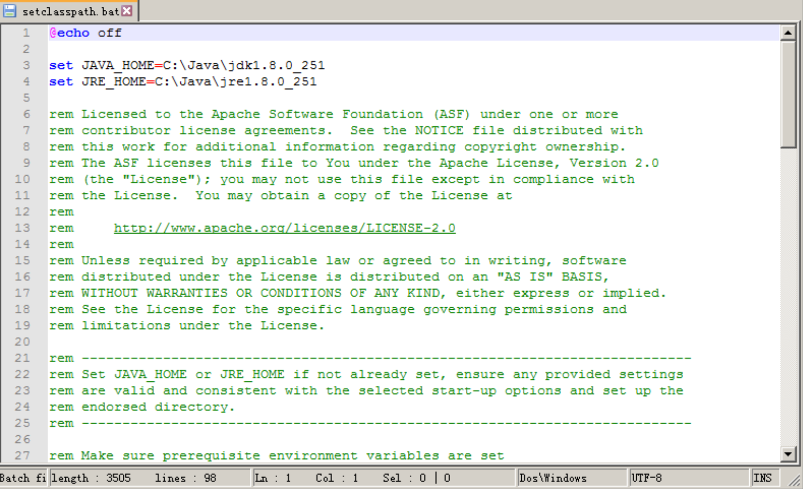
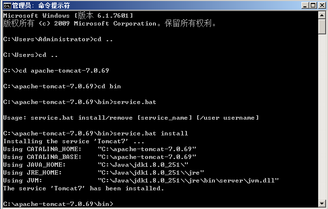
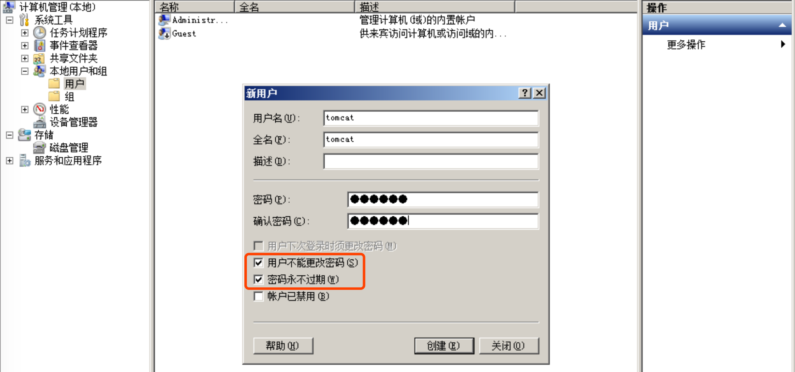
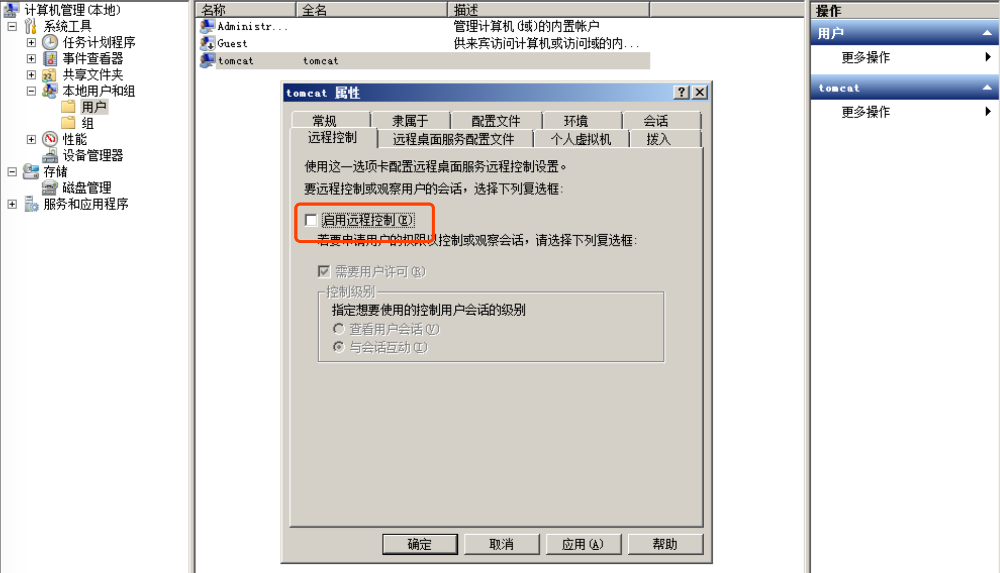
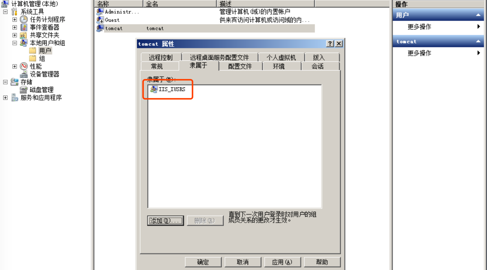
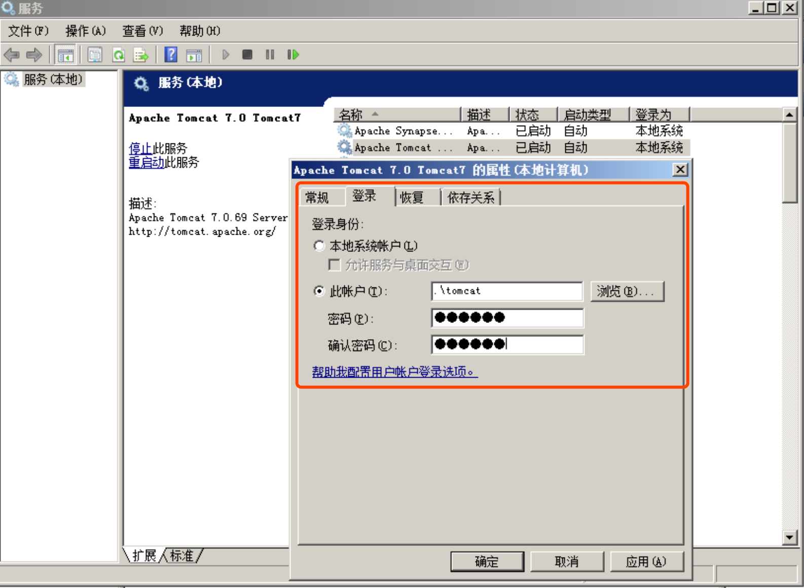

# Tomcat安装步骤-自启动
`@Time   : 2020/8/3 13:16`
`@Author : 852782749@qq.com`


```
开始编辑～
```
###  tomcat 下载地址 根据需求下载对应版本即可
`https://archive.apache.org/dist/tomcat/`

### 配置JAVA_HOME
```angular2html
JAVA_HOME C:\Java\jdk1.8.0_251
```

### 配置 CATALINA_HOME
```angular2html
这台电脑->属性->高级配置->环境变量
用户变量
CATALINA_HOME
C:\apache-tomcat-7.0.69\bin
```
### 配置path
```angular2html
path
%JAVA_HOME%\bin;%JAVA_HOME%\jre\bin;%CATALINA_HOME%\bin;
```

### 配置启动信息(！！！重要)
```angular2html
在CATALINA_HOME（C:\apache-tomcat-7.0.69\bin：压缩包解压后目录）目录下找到

setclasspath.bat

在行首添加如下代码

set JAVA_HOME=jdk安装路径
set JRE_HOME=jre安装路径

例如：
set JAVA_HOME=C:\Java\jdk1.8.0_251
set JRE_HOME=C:\Java\jre1.8.0_251

```


### 配置服务
```angular2html
service.bat install/remove
```


### 普通用户权限启动
#### 创建新用户
```angular2html
控制面板->计算机管理->本地用户和组->用户->新用户
```

```angular2html
右键新用户->属性：设置远程控制和隶属组，设置成下图
```



#### 修改服务登录账户
```angular2html
管理工具->服务
```

点击应用后，重启服务即可完成

> 乾坤未定，你我皆是黑马