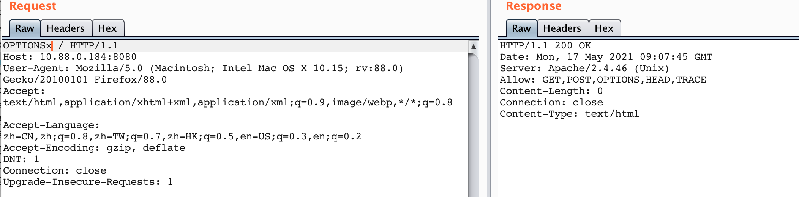
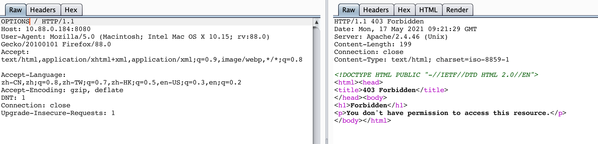
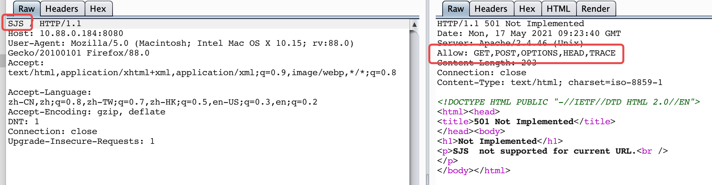
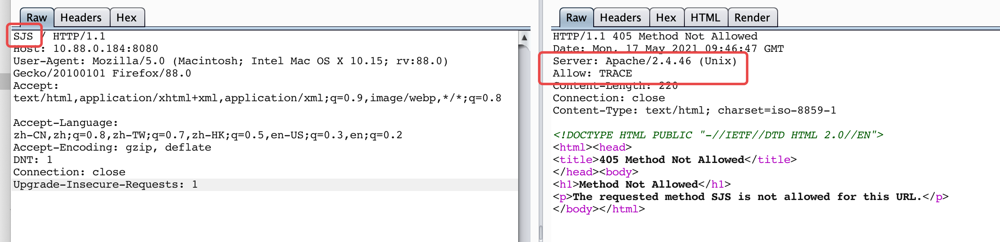
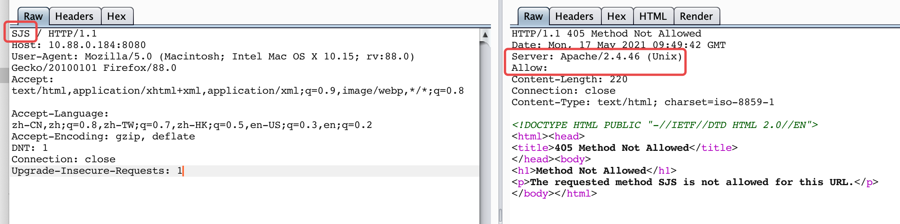

# 启用不安全的http方法解决方案-apache
`@Time   : 2021/5/17 下午5:04`
`@Author : 852782749@qq.com`


```
开始编辑～
```

### 说明
```angular2html
apache默认安装之后，会开启多个http方法,
网络上有好多个修复方式是通过过滤的形式进行限制，但是治标不治本
```

### 如果只使用过滤http方法进行限制会出现下列问题
```angular2html
使用过滤限制http请求方法的步骤
在httpd.conf配置文件中取消mod_rewrite.so模块的注释
#LoadModule rewrite_module modules/mod_rewrite.so
```
> 然后填写下列内容
```
RewriteEngine On
RewriteCond %{REQUEST_METHOD} ^(TRACE|TRACK|OPTIONS)
RewriteRule .* - [F]
```
> 当重启apache服务之后，再次构造OPTIONS方法会出现403错误，这样问题就解决了吗？

>
>
> 这时脑子灵光一闪，输入不存在的http方法试试？

> 这不对啊，这是什么问题？怀着好奇的心思，恢复了apache默认配置，仍然是这个问题

>
> 这样一来，当出现不存在的http方法时，apache也会打印如OPTIONS的作用一样的信息
### 正确修复方式
```angular2html
取消配置文件中mod_allowmethods.so模块的注释
#LoadModule allowmethods_module modules/mod_allowmethods.so
```
>
> 在配置文件最后添加下列内容
```angular2html
<Location "/">
AllowMethods GET POST
</Location>

```
> 重启服务之后再次验证,http方法果然减少，但还是有TRACE方法存在，

> 继续在配置文件后添加下列内容
```angular2html
TraceEnable off
```
> 再次测试,此时已全部解决，如有疑问，可以发送邮件继续讨论



> 乾坤未定，你我皆是黑马