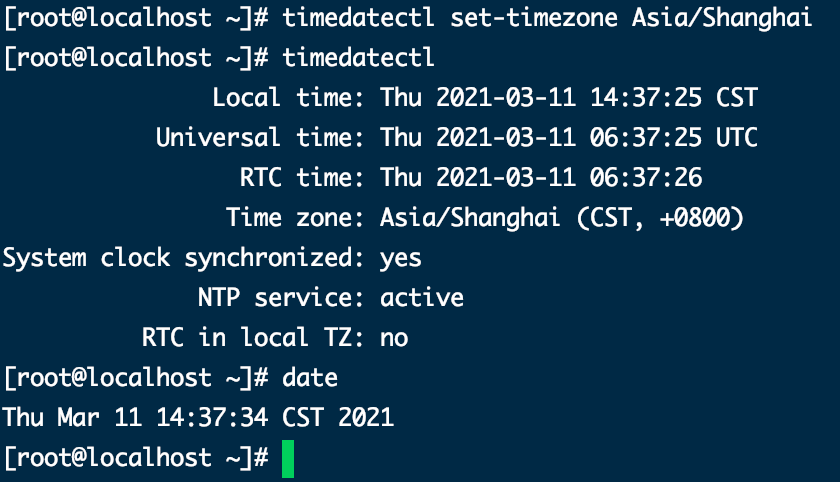
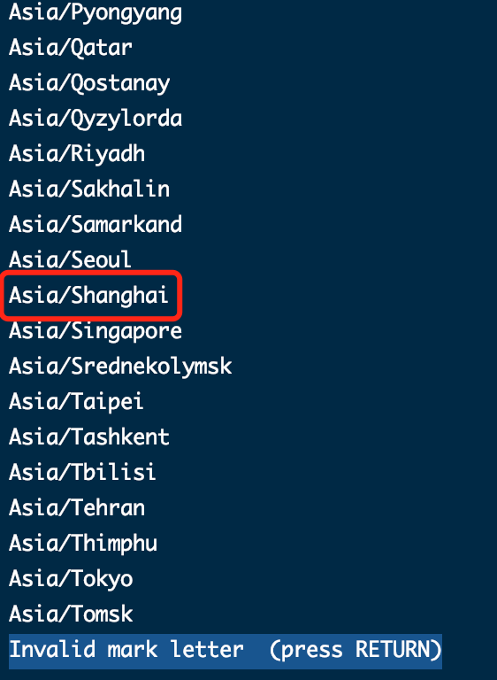

# CentOS 8 修改时区信息
`@Time   : 2021/3/11 下午2:40`
`@Author : 852782749@qq.com`


```
开始编辑～
```
```angular2
设置定时任务去执行脚本，脚本一直不执行，发现存在时区问题，本次介绍时区修改方式

timedatectl是一个命令行工具，它允许你查看并且修改系统时间和日期。它在所有现代的基于 systemd 的 Linux 系统中都可以使用
```

### 使用命令`timedatectl`检查当前时区 



### 运行`timedatectl list-timezones`查看所有时区，这里选择了`Asia/Shanghai`



### 使用命令`sudo timedatectl set-timezone Asia/Shanghai`指定时区


> 乾坤未定，你我皆是黑马