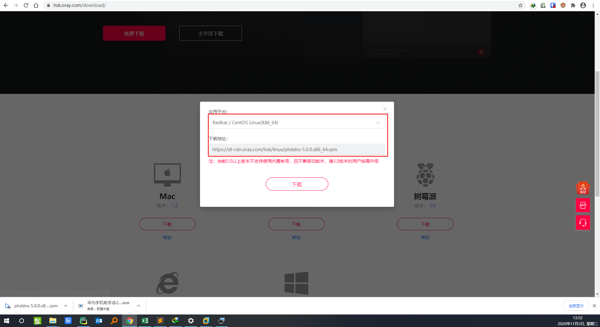
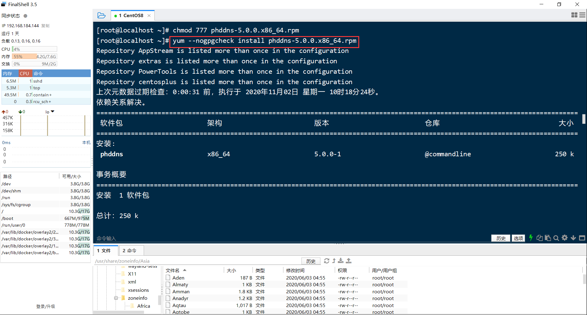
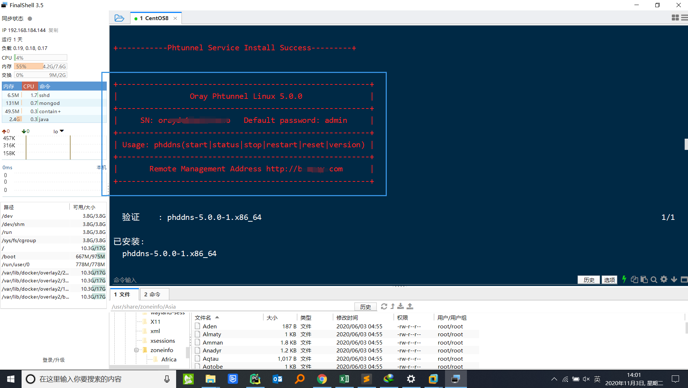
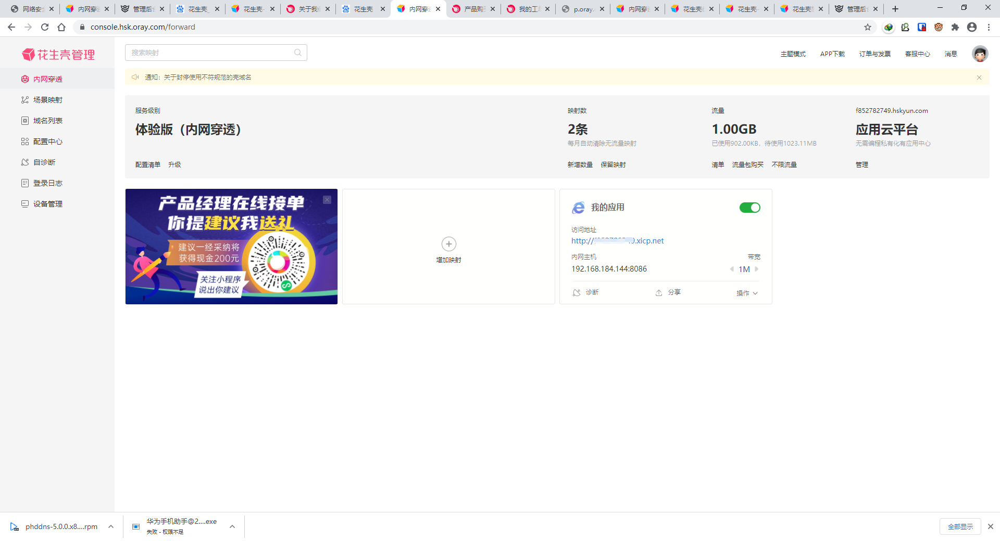
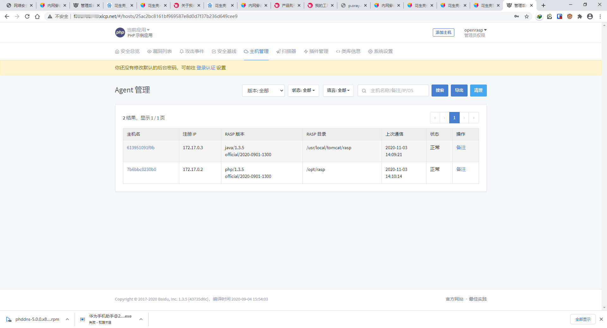

# CentOS 8 安装花生壳并配置内网穿透
` @Time : 2020年11月3日, 0003 13:47`
` @Author  : 862897316@qq.com`
` @Software: PyCharm`

```
开始编写
```
```angular2html
今天下午突然想到在花生壳刚刚兴起的时候，自己抢先注册的几个体验版账号，
觉得可以跟最近研究的openrasp联合起来，这样，我就可以在其他地方远程使用了
限制还是比较多的，体验版带宽1M，流量1G
```

### 安装花生壳
```angular2html
官网下载地址
https://hsk.oray.com/download/
```
 
> 这里可以选择多个操作系统，比刚刚兴起的时候，功能更多了，当时只有Windows版本的，
### 安装

> 将下载的rpm文件上传至CentOS，使用命令`yum --nogpgcheck install phddns-5.0.0.x86_64.rpm`
K
> 安装完成之后，可以看到相应的管理地址和SN号，后续需要使用SN号登录管理平台进行映射配置


> 这里需要注意，使用SN登录账户之后，还是需要绑定花生壳账户的，可以把SN理解成一个client，需要跟域名绑定才能使用


### 效果图


> 乾坤未定,你我皆是黑马