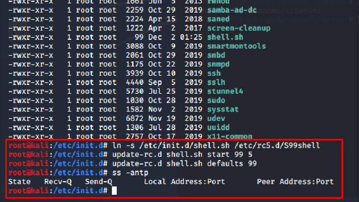
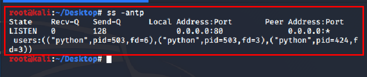

# kali2019之后版本脚本自启动
` @Time : 2020年12月2日, 0002 14:08`
` @Author  : 862897316@qq.com`
` @Software: PyCharm`

```
开始编写
```
### 脚本自启动
```angular2html
印象中，kali系统中是存在rc.local文件的，但是使用虚拟机安装的系统里面，并没有找到rc.loacl文件

因此设置脚本自启动方式就遇到了阻碍
```
### 编辑shell脚本并添加执行权限
```angular2html
#!/bin/bash
cd /root/Desktop/
nohup python MyServer.py &
nohup python3 cc.py &
```
> `# chmod +x shell.sh`

### 将脚本移动至`/etc/init.d/`目录
> `# mv shell.sh /etc/init.d/`
> 
> '#cd /etc/init.d/'
>
> `/etc/init.d/# chmod +x shell.sh`

### 设置脚本链接并配置自启动
> `# cd /etc/init.d/`
>
> `etc/init.d/# ln -s /etc/init.d/shell.sh /etc/rc5.d/S99shell`
>
> `etc/init.d/# update-rc.d shell.sh start 99 5`
>
> `etc/init.d/# update-rc.d shell.sh defaults 99 `

### 验证启动效果

#### 配置完成，重启测试


#### 重启完成



```angular2html
到这里就是配置了80端口服务开机自启

但是kali应该还会有其他方法，希望看到这里的道友能够找到更好的方法
```

> 乾坤未定,你我皆是黑马