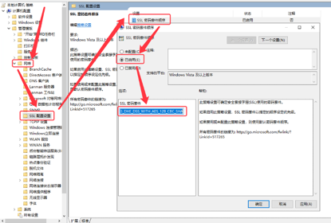

# 漏洞修复-SSL/TLS协议信息泄露漏洞(CVE-2016-2183)【原理扫描】

`@Time   : 2022/10/20 09:30`
`@Author : 852782749@qq.com`

```
开始编辑～
```
### 漏洞简介
```angular2html
TLS是安全传输层协议，用于在两个通信应用程序之间提供保密性和数据完整性。
TLS, SSH, IPSec协商及其他产品中使用的IDEA、DES及Triple DES密码或者3DES及Triple 3DES存在大约四十亿块的生日界，这可使远程攻击者通过Sweet32攻击，获取纯文本数据。
<*来源：Karthik Bhargavan
        Gaetan Leurent
  链接：https://www.openssl.org/news/secadv/20160922.txt*>

```
### Windows RDP修复方法
> 在命令行输入【gpedit】打开`组策略-计算机配置-管理模板-网络-SSL配置设置-SSL密码套件顺序-【已启用】`
> 
> 将SSL套件修改为下列内容
```angular2html
TLS_AES_256_GCM_SHA384,TLS_AES_128_GCM_SHA256,TLS_ECDHE_ECDSA_WITH_AES_256_GCM_SHA384,TLS_ECDHE_ECDSA_WITH_AES_128_GCM_SHA256,TLS_ECDHE_RSA_WITH_AES_256_GCM_SHA384,TLS_ECDHE_RSA_WITH_AES_128_GCM_SHA256,TLS_DHE_RSA_WITH_AES_256_GCM_SHA384,TLS_DHE_RSA_WITH_AES_128_GCM_SHA256,TLS_ECDHE_ECDSA_WITH_AES_256_CBC_SHA384,TLS_ECDHE_ECDSA_WITH_AES_128_CBC_SHA256,TLS_ECDHE_RSA_WITH_AES_256_CBC_SHA384,TLS_ECDHE_RSA_WITH_AES_128_CBC_SHA256,TLS_ECDHE_ECDSA_WITH_AES_256_CBC_SHA,TLS_ECDHE_ECDSA_WITH_AES_128_CBC_SHA,TLS_ECDHE_RSA_WITH_AES_256_CBC_SHA,TLS_ECDHE_RSA_WITH_AES_128_CBC_SHA,TLS_RSA_WITH_AES_256_GCM_SHA384,TLS_RSA_WITH_AES_128_GCM_SHA256,TLS_RSA_WITH_AES_256_CBC_SHA256,TLS_RSA_WITH_AES_128_CBC_SHA256,TLS_RSA_WITH_AES_256_CBC_SHA,TLS_RSA_WITH_AES_128_CBC_SHA,TLS_RSA_WITH_NULL_SHA256,TLS_RSA_WITH_NULL_SHA,TLS_PSK_WITH_AES_256_GCM_SHA384,TLS_PSK_WITH_AES_128_GCM_SHA256,TLS_PSK_WITH_AES_256_CBC_SHA384,TLS_PSK_WITH_AES_128_CBC_SHA256,TLS_PSK_WITH_NULL_SHA384,TLS_PSK_WITH_NULL_SHA256
```
> 若担心复制出现格式问题，可以先复制到记事本里
>


### 替换完成后重启服务器即可

## 注意！！！注意！！！注意！！！
> 当前使用的ssl套接字对应的操作系统是Windows Server2019的
> 
> 如果是其他版本的操作系统可以直接使用相应的套接字进行替换
> 
> 需要注意，Windows默认情况下套接字是用`、`号分开的不是`,`号，需要做一次替换
> 
> 不然会出现`远程连接错误`的提示，


> 乾坤未定，你我皆是黑马