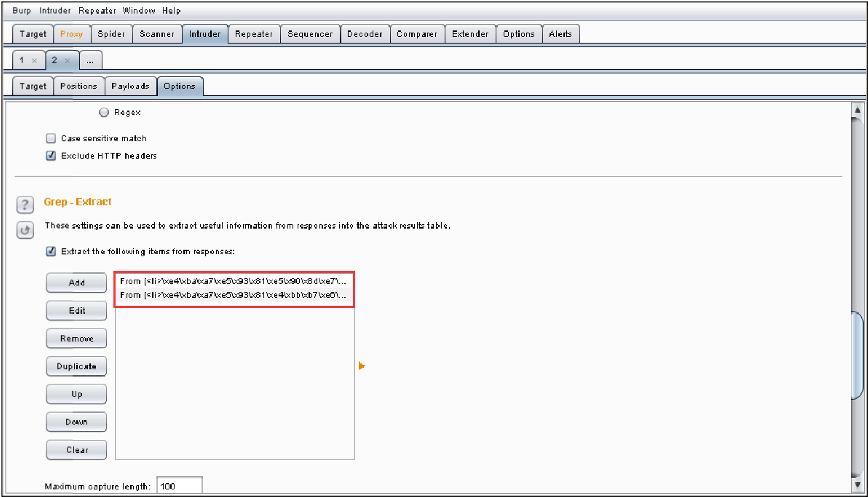

# 使用BurpSuite爬取商品信息
`@Time   : 2021/5/19 上午9:36`
`@Author : 852782749@qq.com`


```
开始编辑～
```
### 打开BurpSuite后，抓取商品信息url
```angular2html
./index.php?r=default/photo/content&id=
通过修改id的值，可以遍历所有商品
```
### 使用burpsuite将抓取到的商品详情数据包发送至【intruder】模块

### 使用【intruder】模块中【Postitions】功能的【Clear】按钮，清除用不到的变量，并将id的值设置成变量

### 切换到【Payloads】功能下，将【Payload Sets】中【Payload type】设置为【number】，并将【Payload Options[Numbers]】设置成下面的内容

### 然后继续切换至【Options】功能，向下滚动滑块至【Grep-Extract】功能

### 点击【Grep-Extract】下的【Add】，选择要提取的内容，例如：提取产品名称，选择要提取的内容后，工具会自动生成正则表达式，点击【OK】完成产品名称内容的正则表达式

### 可以重复上一步添加其他需要爬去的信息，如商品价格

### 创建完成产品名称和产品价格的正则表达式之后的界面如下

### 在【burpsuite】菜单栏选择【intruder】菜单下的【Start attack】，开始枚举系统中的商品信息

### 选择菜单栏里面的【Save】菜单，使用【Results table】导出数据

### 将弹出的界面设置成如图17所示的配置，并点击【Save】进行保存到桌面，命名为【商品.txt】

### 收集的信息如下


> 乾坤未定，你我皆是黑马