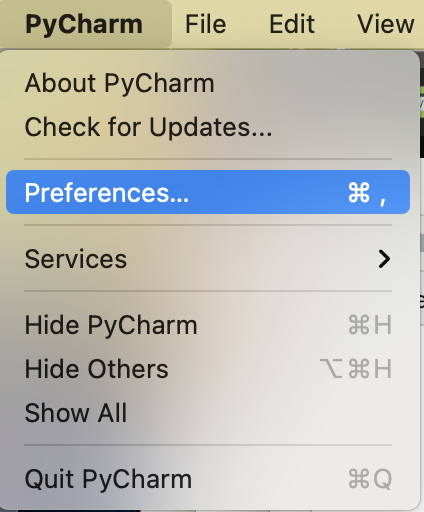
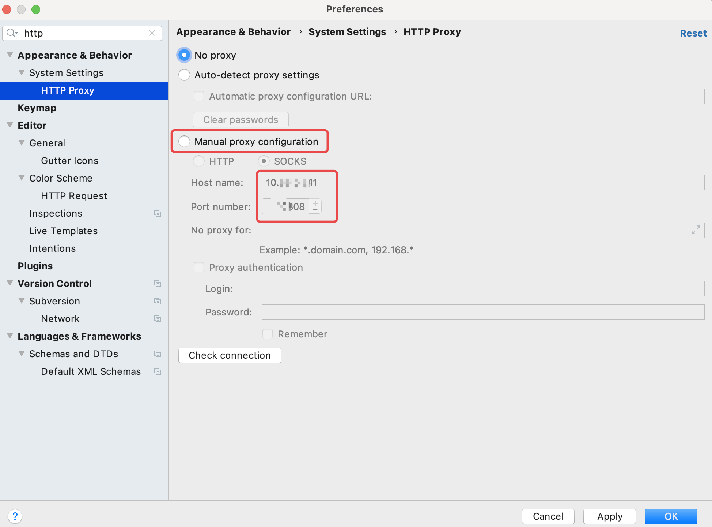

# PyCharm设置代理服务器
`@Time   : 2021/6/17 下午5:21`
`@Author : 852782749@qq.com`


```
开始编辑～
```
### Mac版
> 打开Preferencces配置页面，

>
> 在搜索框输入`http`，选中`Manual proxy configuration`后，配置代理服务器，有http和socks两种方式



> 配置完成后单击`Apply`应用配置


> 乾坤未定，你我皆是黑马