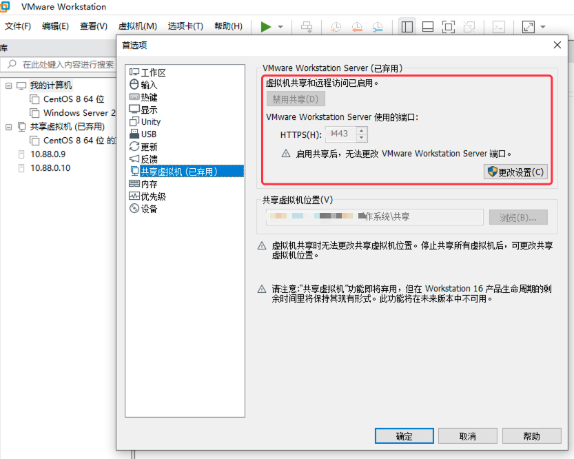
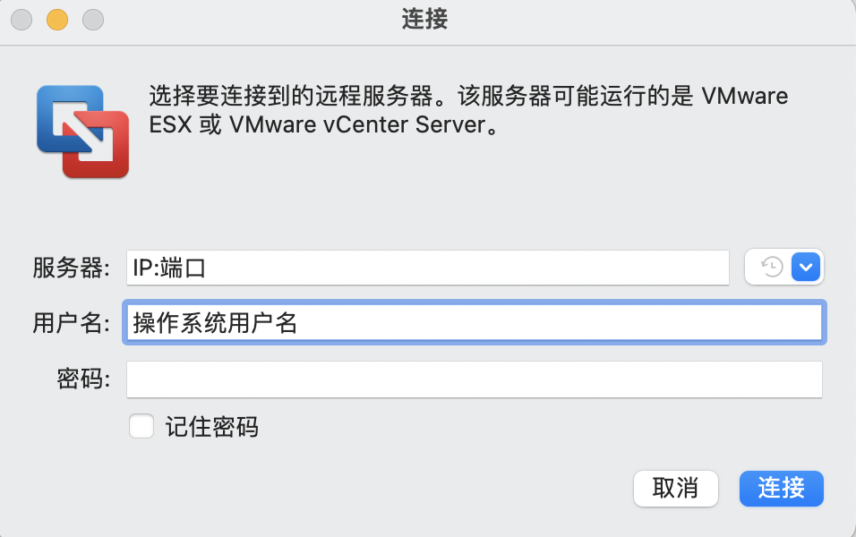
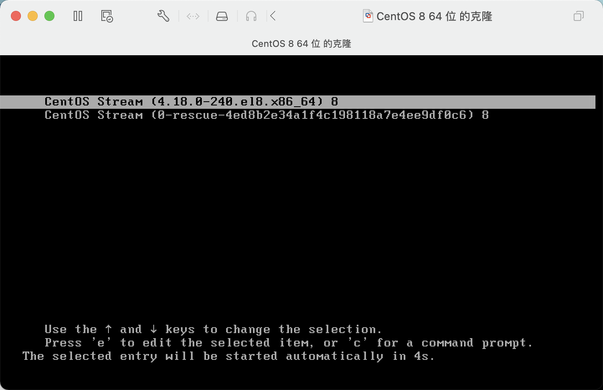
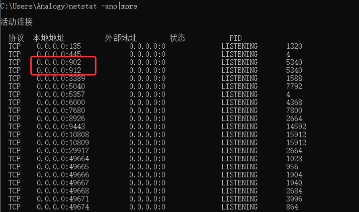

# VMware Workstation 16.1共享虚拟机远程连接配置方法

`@Time   : 2021/12/9 14:36`
`@Author : 852782749@qq.com`

```
开始编辑～
```

```angular2html
VMware Workstation 一直是可以共享虚拟机让远程的客户端通过ip地址进行访问的，
VMware Workstation 16.1显示共享虚拟机（已弃用），但是可以临时开启
```
### 开启`共享虚拟机`方法如下
> `菜单栏`-`编辑`-`首选项`-`启用共享`;
> 

> 注意：
> 
> 需要配置好共享虚拟机位置（自行设置即可）；
> 
> https端口（后续用于连接的端口）
> 


> 切换到客户端
> 


> 注意：可以使用操作系统账户和密码，也可以新建一个账户用于连接（拥有远程连接权限即可）
> 
> 如下图所示，开机成功



### 遇到的坑
#### `无法连接 MKS: Failed to connect to server xx.xx.xx.xx:903`
```angular2html
以下内容把共享虚拟机的电脑称为服务端，连接共享虚拟机的电脑称为客户端

当客户端连接服务端的时候，
    客户端会获取服务端的远程配置包括连接端口（启用共享时配置的端口）、
    管理系统的窗口（902端口或903端口、912端口）
```
```
客户端本身不会有配置这些端口的文件，会在连接的时候从服务端获取，所以需要在服务器端核查配置文件是否正确；
    我在用客户端连接服务端的时候，一直出现白屏，
    然后提示 无法连接 MKS: Failed to connect to server xx.xx.xx.xx:903
    核查配置文件 C:\ProgramData\VMware\VMware Workstation\config.ini 发现也是连接的903端口
```
#### `config.ini`文件信息
```angular2html
authd.client.port = "903"
authd.proxy.nfc = "vmware-hostd:ha-nfc"
installerDefaults.autoSoftwareUpdateEnabled = "no"
installerDefaults.autoSoftwareUpdateEnabled.epoch = "10100"
installerDefaults.componentDownloadEnabled = "yes"
installerDefaults.dataCollectionEnabled = "yes"
installerDefaults.dataCollectionEnabled.epoch = "10100"

```
#### 先说解决方法：将`903`修改为`902`即可;继续向下看排查步骤
> 使用命令`netstat -ano`查看开放端口以及PID`5340`(请先定位这个值,在任务管理器加一列PID就可以看到)
> 
> 服务端只开放了902、912端口，所以在客户端加载服务端配置的时候，获取和连接的都是`903`端口，而不是一直处于运行中的`902`端口；

```angular2html

```


> 乾坤未定，你我皆是黑马